# MyRecruita - Comprehensive Project Documentation

> **Knowledge Base Reference Document**  
> **Last Updated**: January 2025  
> **Version**: 2.5.1  
> **Status**: Production

---

## Table of Contents

### Core Documentation
1. [Executive Summary & Project Vision](#1-executive-summary--project-vision)
2. [Application Identity & Branding](#2-application-identity--branding)
3. [Technology Stack](#3-technology-stack)
4. [Architecture Overview](#4-architecture-overview)
5. [Database Schema](#5-database-schema)
6. [Permission & Role System](#6-permission--role-system)

### Industry Standards & Best Practices (NEW)
7. [Personas & Role Boundaries](#7-personas--role-boundaries-industry-standard)
8. [User Journeys (Critical Flows)](#8-user-journeys-critical-flows)
9. [UX/UI Rules](#9-uxui-rules-industry-standards)
10. [Engineering Standards](#10-engineering-standards-best-practices)
11. [Data & Security](#11-data--security-industry-standards)

### Technical Implementation
12. [Supabase Edge Functions](#12-supabase-edge-functions)
13. [AI Features & Capabilities](#13-ai-features--capabilities)
14. [Application Routes & Navigation](#14-application-routes--navigation)
15. [Admin Dashboard](#15-admin-dashboard)
16. [CV Management System](#16-cv-management-system)
17. [Candidate Pipeline](#17-candidate-pipeline)
18. [Job Management System](#18-job-management-system)
19. [Blog & Content Management](#19-blog--content-management)
20. [Notification System](#20-notification-system)
20.5. [Staff Accountability System](#155-staff-accountability-system-new)
20.6. [Automation System](#156-automation-system)
20.7. [Reports Module](#157-reports-module)
20.8. [Calendar & Scheduling Module](#158-calendar--scheduling-module)
21. [PWA & Progressive Features](#21-pwa--progressive-features)
22. [SEO & Structured Data](#22-seo--structured-data)
23. [Public-Facing Features](#23-public-facing-features)
24. [Authentication & Security](#24-authentication--security)
25. [Key Hooks & Utilities](#25-key-hooks--utilities)

### Development & Maintenance
26. [Component Patterns](#26-component-patterns)
27. [Development Guidelines](#27-development-guidelines)
28. [Feature Implementation Checklist](#28-feature-implementation-checklist)
29. [Future Roadmap](#29-future-roadmap)
30. [Changelog](#30-changelog)
31. [Knowledge Base Instructions](#31-knowledge-base-instructions)

---

## 1. Executive Summary & Project Vision

### What is MyRecruita?

MyRecruita is a **Recruitment Agency Content Management System (CMS)** designed to streamline recruitment agency operations through AI-powered automation and industry-standard features. It serves as a comprehensive platform for managing candidates, job postings, client relationships, and the entire recruitment lifecycle.

### Core Mission

- **Streamline CV Management**: AI-powered parsing and scoring eliminates manual data entry
- **Automate Candidate Matching**: Intelligent algorithms match candidates to jobs instantly
- **Visual Pipeline Tracking**: Kanban-style boards for tracking candidates through hiring stages
- **Reduce Manual Work**: Bulk import, email ingestion, and automation features
- **Real-Time Collaboration**: Multi-channel notifications keep teams synchronized

### Target Users

| User Role | Primary Functions |
|-----------|------------------|
| **Recruiters** | Daily CV review, job posting, candidate pipeline management, client communication |
| **Account Managers** | Client relationship management, job status tracking, placement tracking |
| **Marketing Team** | Blog management, talent showcase, employer branding content |
| **Administrators** | User management, permissions, system settings, full access |
| **CV Uploaders** | Limited data entry access for uploading and parsing CVs |
| **Viewers** | Read-only access for stakeholders and auditors |

### Competitive Advantages

- ✅ **APSCo-Accredited Platform** - Industry-recognized recruitment standards
- ✅ **AI-Powered CV Parsing** - 6-category scoring with detailed breakdowns
- ✅ **Real-Time Job Matching** - Instant candidate-to-job relevance scoring
- ✅ **Email Ingestion** - Automatic job status updates from client emails
- ✅ **Progressive Web App** - Installable app with offline support
- ✅ **Granular Permissions** - 28 permission types across 6 roles
- ✅ **Multi-Channel Notifications** - Push, email, and in-app alerts

### Specialist Sectors

MyRecruita specializes in recruitment for:
- 💼 **Finance & Accounting** - CFOs, Financial Controllers, Accountants
- 💻 **Information Technology** - Developers, DevOps, IT Managers
- ⚖️ **Legal** - Solicitors, Legal Counsel, Compliance Officers
- 👥 **Human Resources** - HR Directors, Talent Acquisition, L&D
- 🎯 **Executive Search** - C-Suite, Board Members, Senior Leadership

---

## 2. Application Identity & Branding

### Brand Information

| Property | Value |
|----------|-------|
| **Name** | MyRecruita |
| **Tagline** | "Your Career Partner" |
| **Accreditation** | APSCo Member |
| **Primary Domain** | myrecruita-career-hub.lovable.app |
| **Supabase Project ID** | yoegksjmdtubnkgdtttj |

### Visual Identity

```css
/* Primary Brand Colors (HSL) */
--primary: 217 91% 60%;           /* Blue - Trust, Professionalism */
--secondary: 210 40% 96%;         /* Light Blue - Clean, Modern */
--accent: 43 96% 56%;             /* Gold/Amber - Premium, Achievement */

/* Semantic Colors */
--destructive: 0 84% 60%;         /* Red - Errors, Rejections */
--success: 142 76% 36%;           /* Green - Success, Placed */
--warning: 38 92% 50%;            /* Orange - Warnings, Attention */
```

### Logo & Assets

- **Logo Location**: `public/lovable-uploads/`
- **APSCo Certificate**: `public/images/apsco-certificate.png`
- **APSCo Logo**: `public/images/apsco-logo.png`
- **Blog Images**: `public/images/` and `src/assets/`

---

## 3. Technology Stack

### Frontend Technologies

| Technology | Version | Purpose |
|------------|---------|---------|
| **React** | ^18.3.1 | UI framework with hooks |
| **TypeScript** | ^5.x | Static type safety |
| **Vite** | ^5.x | Build tool & dev server |
| **Tailwind CSS** | ^3.4 | Utility-first CSS framework |
| **shadcn/ui** | Latest | Pre-built accessible components |
| **React Router** | ^6.26.2 | Client-side routing with lazy loading |
| **TanStack React Query** | ^5.83.0 | Server state management & caching |
| **React Hook Form** | ^7.53.0 | Form state management |
| **Zod** | ^3.23.8 | Schema validation |
| **Recharts** | ^2.12.7 | Data visualization charts |
| **Lucide React** | ^0.462.0 | Icon library (500+ icons) |
| **date-fns** | ^4.1.0 | Date manipulation utilities |
| **sonner** | ^1.5.0 | Toast notification system |
| **cmdk** | ^1.0.0 | Command palette (⌘K) |
| **vaul** | ^0.9.3 | Drawer component |
| **embla-carousel-react** | ^8.3.0 | Carousel/slider component |

### Backend Technologies (Supabase)

| Service | Purpose |
|---------|---------|
| **PostgreSQL** | Relational database with Row Level Security |
| **Edge Functions** | Deno-based serverless functions (TypeScript) |
| **Auth** | Email/password authentication with OTP |
| **Storage** | Secure file storage for CVs and documents |
| **Realtime** | WebSocket subscriptions for live updates |

### External Integrations

| Service | Purpose | Secret Key |
|---------|---------|------------|
| **Lovable AI Gateway** | Gemini AI for CV parsing, matching | `LOVABLE_API_KEY` |
| **Progressier** | PWA, push notifications | `PROGRESSIER_APP_ID`, `PROGRESSIER_API_KEY` |
| **Resend** | Transactional email delivery | `RESEND_API_KEY` |
| **Postmark** | Email ingestion webhooks | (via webhook URL) |

### AI Gateway Configuration

```typescript
// AI Gateway Endpoint
const AI_GATEWAY_URL = "https://ai.gateway.lovable.dev/v1/chat/completions";

// Default Model
const AI_MODEL = "google/gemini-3-flash-preview";

// Features Available
- Function calling (structured output)
- JSON mode responses
- Multi-turn conversations
- Large context window
```

---

## 4. Architecture Overview

### System Architecture Diagram

```
┌─────────────────────────────────────────────────────────────────┐
│                         FRONTEND                                 │
│  ┌─────────────┐  ┌─────────────┐  ┌─────────────────────────┐  │
│  │   React     │  │  React      │  │   TanStack Query        │  │
│  │   Router    │  │  Components │  │   (Server State)        │  │
│  └─────────────┘  └─────────────┘  └─────────────────────────┘  │
└─────────────────────────────────────────────────────────────────┘
                              │
                              ▼
┌─────────────────────────────────────────────────────────────────┐
│                      SUPABASE CLIENT                             │
│  ┌─────────────┐  ┌─────────────┐  ┌─────────────────────────┐  │
│  │   Auth      │  │   Database  │  │   Storage               │  │
│  │   Client    │  │   Client    │  │   Client                │  │
│  └─────────────┘  └─────────────┘  └─────────────────────────┘  │
└─────────────────────────────────────────────────────────────────┘
                              │
                              ▼
┌─────────────────────────────────────────────────────────────────┐
│                      SUPABASE BACKEND                            │
│  ┌─────────────────────────────────────────────────────────────┐│
│  │                    Edge Functions (Deno)                     ││
│  │  ┌──────────┐ ┌──────────┐ ┌──────────┐ ┌──────────┐       ││
│  │  │ parse-cv │ │ match-cv │ │ process  │ │ send     │       ││
│  │  │          │ │ -to-job  │ │ -bulk    │ │ -notif   │       ││
│  │  └──────────┘ └──────────┘ └──────────┘ └──────────┘       ││
│  └─────────────────────────────────────────────────────────────┘│
│  ┌─────────────────────────────────────────────────────────────┐│
│  │                    PostgreSQL Database                       ││
│  │  26 Tables • Row Level Security • Triggers • Functions      ││
│  └─────────────────────────────────────────────────────────────┘│
│  ┌─────────────────────────────────────────────────────────────┐│
│  │                    Storage Buckets                           ││
│  │  cv-uploads (private)                                        ││
│  └─────────────────────────────────────────────────────────────┘│
└─────────────────────────────────────────────────────────────────┘
                              │
                              ▼
┌─────────────────────────────────────────────────────────────────┐
│                   EXTERNAL SERVICES                              │
│  ┌─────────────┐  ┌─────────────┐  ┌─────────────────────────┐  │
│  │  Lovable    │  │ Progressier │  │   Resend / Postmark     │  │
│  │  AI Gateway │  │ (PWA/Push)  │  │   (Email)               │  │
│  └─────────────┘  └─────────────┘  └─────────────────────────┘  │
└─────────────────────────────────────────────────────────────────┘
```

### Data Flow Patterns

**CV Submission Flow**:
```
User Upload → Storage → Database → Edge Function → AI Parse → Update DB → Notify Admins
```

**Job Matching Flow**:
```
Select Job → Fetch Candidates → Filter → AI Match → Score & Rank → Display Results
```

**Pipeline Update Flow**:
```
Drag Card → Update Stage → Log Activity → Realtime Broadcast → Update UI
```

---

## 5. Database Schema

### Complete Table Reference (26 Tables)

#### Core Recruitment Tables

| Table | Purpose | Key Fields |
|-------|---------|------------|
| `cv_submissions` | Candidate CV data | name, email, phone, job_title, cv_file_url, cv_score, ai_profile |
| `jobs` | Job postings | reference_id, title, location, sector, status, requirements |
| `job_applications` | Applications to jobs | job_id, user_id, cv_file_url, message |
| `talent_profiles` | Featured talent | reference_id, role, sector, years_experience, is_visible |
| `talent_requests` | Employer talent inquiries | talent_id, company_name, contact_name, email |

#### Candidate Pipeline Tables

| Table | Purpose | Key Fields |
|-------|---------|------------|
| `candidate_pipeline` | Pipeline entries | cv_submission_id, job_id, stage, priority, notes, assigned_to |
| `pipeline_activity` | Activity audit log | pipeline_id, action, from_stage, to_stage, note, created_by |

#### Admin & Staff Tables

| Table | Purpose | Key Fields |
|-------|---------|------------|
| `admin_profiles` | Admin user profiles | user_id, email, role, display_name, avatar_url |
| `staff_permissions` | Granular permissions | user_id, permission, granted_by |
| `user_profiles` | Regular user profiles | user_id, email, full_name, cv_file_url, phone |

#### Notification Tables

| Table | Purpose | Key Fields |
|-------|---------|------------|
| `notifications` | In-app notifications | user_id, title, message, category, read, link |
| `notification_preferences` | User preferences | user_id, email_enabled, push_enabled, event_preferences |

#### Bulk Import Tables

| Table | Purpose | Key Fields |
|-------|---------|------------|
| `bulk_import_sessions` | Import session tracking | status, total_files, imported_count, failed_count, user_id |
| `bulk_import_files` | Individual file status | session_id, file_name, status, parsed_data, error_message |
| `cv_upload_activity_log` | Audit trail | user_id, action, details, user_email |

#### Email Processing Tables

| Table | Purpose | Key Fields |
|-------|---------|------------|
| `email_ingestion_log` | Incoming email log | message_id, from_email, subject, status, is_relevant, filter_reason |
| `job_status_updates` | AI-detected status changes | job_id, suggested_status, confidence_score, ai_reasoning, reviewed_by |

#### Blog Tables

| Table | Purpose | Key Fields |
|-------|---------|------------|
| `blog_posts` | Blog articles | title, slug, content, is_published, author_name, view_count |
| `blog_categories` | Post categories | name, slug, description |
| `blog_tags` | Post tags | name, slug |
| `blog_post_tags` | Post-tag junction | post_id, tag_id |

#### Submission Tables

| Table | Purpose | Key Fields |
|-------|---------|------------|
| `contact_submissions` | Contact form entries | name, email, inquiry_type, message, subject, company |
| `career_partner_requests` | Career partner inquiries | name, email, service_type, message, phone |
| `employer_job_submissions` | Employer job requests | company_name, job_title, job_description, contact_name |

#### Settings Table

| Table | Purpose | Key Fields |
|-------|---------|------------|
| `app_settings` | Application configuration | key, value (JSON), description, updated_by |

### CV Submissions Schema (Detailed)

```sql
cv_submissions {
  id: uuid (PK)
  name: text NOT NULL
  email: text NOT NULL
  phone: text NOT NULL
  cv_file_url: text
  
  -- AI-Generated Fields
  ai_profile: jsonb {
    summary_for_matching: string
    key_achievements: string[]
    hard_skills: string[]
    soft_skills: string[]
    certifications: string[]
    industries: string[]
    experience_years: number
    seniority: string
    education: { level, field, institution }
    ideal_roles: string[]
    career_progression: string
  }
  cv_score: integer (0-100)
  cv_score_breakdown: jsonb {
    completeness: number (0-20)
    skills: number (0-20)
    experience: number (0-25)
    achievements: number (0-15)
    education: number (0-10)
    presentation: number (0-10)
  }
  
  -- Extracted Fields
  job_title: text
  location: text
  sector: text
  seniority_level: text
  education_level: text
  years_experience: integer
  skills: text
  experience_summary: text
  
  -- Metadata
  source: text ('website', 'bulk_import', 'manual', 'email')
  added_by: uuid (admin user_id)
  admin_notes: text
  user_id: uuid (if submitted by logged-in user)
  scored_at: timestamp
  created_at: timestamp
}
```

### Database Functions

| Function | Purpose | Returns |
|----------|---------|---------|
| `is_admin(user_id)` | Check if user is any admin | boolean |
| `is_full_admin(user_id)` | Check if user is full admin | boolean |
| `get_admin_role(user_id)` | Get user's admin role | text |
| `has_permission(user_id, permission)` | Check specific permission | boolean |
| `get_user_permissions(user_id)` | Get all user permissions | permission_type[] |
| `assign_role_permissions(user_id, role)` | Assign role-based permissions | void |
| `generate_job_reference()` | Generate MR-2025-XXX format | text |
| `generate_talent_reference()` | Generate TAL-MR-XXX format | text |
| `update_updated_at_column()` | Trigger for updated_at | trigger |
| `handle_new_user_signup()` | Create user profile on signup | trigger |
| `ensure_notification_preferences()` | Auto-create notification prefs | trigger |
| `sync_notification_event_types()` | Sync event types for all users | void |

---

## 6. Permission & Role System

### Permission Types (28 Total)

```typescript
type PermissionType =
  // CV Permissions (5)
  | "cv.view" | "cv.create" | "cv.update" | "cv.delete" | "cv.export"
  // Job Permissions (4)
  | "jobs.view" | "jobs.create" | "jobs.update" | "jobs.delete"
  // Application Permissions (2)
  | "applications.view" | "applications.manage"
  // Talent Permissions (4)
  | "talent.view" | "talent.create" | "talent.update" | "talent.delete"
  // Pipeline Permissions (4)
  | "pipeline.view" | "pipeline.create" | "pipeline.update" | "pipeline.delete"
  // Submission Permissions (2)
  | "submissions.view" | "submissions.delete"
  // Blog Permissions (4)
  | "blog.view" | "blog.create" | "blog.update" | "blog.delete"
  // Analytics Permissions (1)
  | "analytics.view"
  // Staff Permissions (4)
  | "staff.view" | "staff.create" | "staff.update" | "staff.delete"
  // Settings Permissions (2)
  | "settings.view" | "settings.update"
  // Notification Permissions (1)
  | "notifications.manage";
```

### Role Definitions (6 Roles)

| Role | Description | Key Permissions |
|------|-------------|-----------------|
| **admin** | Full system access | All 28 permissions |
| **recruiter** | Daily recruitment operations | CV, Jobs, Pipeline, Talent, Analytics |
| **account_manager** | Client relationship management | View-only for Jobs, Talent, Pipeline, Analytics |
| **marketing** | Content and branding | Blog (full), Jobs (view), Talent (view), Analytics |
| **cv_uploader** | Data entry personnel | cv.create only |
| **viewer** | Read-only stakeholders | View permissions for CV, Jobs, Talent, Pipeline |

### Complete Role-Permission Matrix

| Permission | Admin | Recruiter | Account Mgr | Marketing | CV Uploader | Viewer |
|------------|:-----:|:---------:|:-----------:|:---------:|:-----------:|:------:|
| cv.view | ✅ | ✅ | ❌ | ❌ | ❌ | ✅ |
| cv.create | ✅ | ✅ | ❌ | ❌ | ✅ | ❌ |
| cv.update | ✅ | ✅ | ❌ | ❌ | ❌ | ❌ |
| cv.delete | ✅ | ✅ | ❌ | ❌ | ❌ | ❌ |
| cv.export | ✅ | ✅ | ❌ | ❌ | ❌ | ❌ |
| jobs.view | ✅ | ✅ | ✅ | ✅ | ❌ | ✅ |
| jobs.create | ✅ | ✅ | ❌ | ❌ | ❌ | ❌ |
| jobs.update | ✅ | ✅ | ❌ | ❌ | ❌ | ❌ |
| jobs.delete | ✅ | ✅ | ❌ | ❌ | ❌ | ❌ |
| applications.view | ✅ | ✅ | ✅ | ❌ | ❌ | ❌ |
| applications.manage | ✅ | ✅ | ❌ | ❌ | ❌ | ❌ |
| talent.view | ✅ | ✅ | ✅ | ✅ | ❌ | ✅ |
| talent.create | ✅ | ✅ | ❌ | ❌ | ❌ | ❌ |
| talent.update | ✅ | ✅ | ❌ | ❌ | ❌ | ❌ |
| talent.delete | ✅ | ✅ | ❌ | ❌ | ❌ | ❌ |
| pipeline.view | ✅ | ✅ | ✅ | ❌ | ❌ | ✅ |
| pipeline.create | ✅ | ✅ | ❌ | ❌ | ❌ | ❌ |
| pipeline.update | ✅ | ✅ | ❌ | ❌ | ❌ | ❌ |
| pipeline.delete | ✅ | ❌ | ❌ | ❌ | ❌ | ❌ |
| submissions.view | ✅ | ❌ | ✅ | ❌ | ❌ | ❌ |
| submissions.delete | ✅ | ❌ | ❌ | ❌ | ❌ | ❌ |
| blog.view | ✅ | ❌ | ❌ | ✅ | ❌ | ❌ |
| blog.create | ✅ | ❌ | ❌ | ✅ | ❌ | ❌ |
| blog.update | ✅ | ❌ | ❌ | ✅ | ❌ | ❌ |
| blog.delete | ✅ | ❌ | ❌ | ✅ | ❌ | ❌ |
| analytics.view | ✅ | ✅ | ✅ | ✅ | ❌ | ❌ |
| staff.view | ✅ | ❌ | ❌ | ❌ | ❌ | ❌ |
| staff.create | ✅ | ❌ | ❌ | ❌ | ❌ | ❌ |
| staff.update | ✅ | ❌ | ❌ | ❌ | ❌ | ❌ |
| staff.delete | ✅ | ❌ | ❌ | ❌ | ❌ | ❌ |
| settings.view | ✅ | ❌ | ❌ | ❌ | ❌ | ❌ |
| settings.update | ✅ | ❌ | ❌ | ❌ | ❌ | ❌ |
| notifications.manage | ✅ | ❌ | ❌ | ❌ | ❌ | ❌ |

### Permission Checking in Code

```typescript
// Hook usage
const { hasPermission, permissions, isFullAdmin } = usePermissions();

// Check single permission
if (hasPermission("cv.delete")) {
  // Show delete button
}

// Check multiple permissions
const canManageJobs = hasPermission("jobs.create") && hasPermission("jobs.update");

// Full admin bypass
if (isFullAdmin) {
  // Show all admin features
}
```

---

## 7. Personas & Role Boundaries (Industry Standard)

### 7.1 Detailed Persona Definitions

#### Administrator (Full Access)
| Attribute | Details |
|-----------|---------|
| **Access Level** | Full System Access |
| **Primary Functions** | User management, system configuration, full data access, security oversight |
| **Key Permissions** | All 28 permissions |
| **Can Access** | Every module, all data, system settings, audit logs |
| **Cannot Do** | N/A - unrestricted access |
| **Notification Defaults** | All events enabled |

#### Recruiter (High Access)
| Attribute | Details |
|-----------|---------|
| **Access Level** | High - Core Operations |
| **Primary Functions** | CV management, job posting, candidate pipeline, talent management |
| **Key Permissions** | CV (full), Jobs (full), Pipeline (create/update/view), Talent (full), Analytics (view) |
| **Can Access** | CV database, job listings, pipeline board, talent profiles, analytics |
| **Cannot Do** | Manage staff/admins, modify system settings, delete pipeline entries, access blog CMS |
| **Notification Defaults** | cv_submission, job_application, employer_job_submission, talent_request, permission_changed, system_updates |

#### Account Manager (Medium Access)
| Attribute | Details |
|-----------|---------|
| **Access Level** | Medium - Client-Focused |
| **Primary Functions** | Client relationship management, submission tracking, talent viewing |
| **Key Permissions** | Jobs (view), Applications (view), Talent (view), Submissions (view), Analytics (view), Pipeline (view) |
| **Can Access** | View-only for jobs, talent, submissions, pipeline, analytics |
| **Cannot Do** | Create/modify CVs, create/modify jobs, manage pipeline, access blog, manage staff |
| **Notification Defaults** | contact_submission, career_partner_request, employer_job_submission, talent_request, permission_changed, system_updates, weekly_digest |

#### Marketing (Limited Access)
| Attribute | Details |
|-----------|---------|
| **Access Level** | Limited - Content Focus |
| **Primary Functions** | Blog management, content creation, employer branding |
| **Key Permissions** | Blog (full), Jobs (view), Talent (view), Analytics (view) |
| **Can Access** | Blog CMS, view job listings, view talent profiles, marketing analytics |
| **Cannot Do** | Access CV database, manage applications, modify pipeline, manage staff |
| **Notification Defaults** | blog_published, permission_changed, system_updates |

#### CV Uploader (Minimal Access)
| Attribute | Details |
|-----------|---------|
| **Access Level** | Minimal - Data Entry Only |
| **Primary Functions** | Upload and create CV entries |
| **Key Permissions** | cv.create only |
| **Can Access** | CV creation form, bulk import (own uploads only for 3 days) |
| **Cannot Do** | View other CVs, export data, delete CVs, access any other module |
| **Notification Defaults** | cv_submission, permission_changed, system_updates |
| **Special Restrictions** | Time-limited access to own uploads (72 hours visibility) |

#### Viewer (Read-Only Access)
| Attribute | Details |
|-----------|---------|
| **Access Level** | Read-Only - Stakeholder View |
| **Primary Functions** | Observe data, review metrics, audit compliance |
| **Key Permissions** | cv.view, jobs.view, talent.view, pipeline.view |
| **Can Access** | Read-only view of CVs, jobs, talent, pipeline |
| **Cannot Do** | Create, modify, or delete any data; export data; access settings |
| **Notification Defaults** | permission_changed, system_updates |

### 7.2 Role Boundaries - Explicit Restrictions

> **Security Principle**: Each role has explicitly defined boundaries to enforce least-privilege access.

| Role | Explicitly CANNOT Do |
|------|---------------------|
| **Recruiter** | ❌ Create/delete staff accounts ❌ Modify system settings ❌ Delete pipeline entries ❌ Manage blog content ❌ Access submissions module directly |
| **Account Manager** | ❌ Create/modify CV entries ❌ Post new jobs ❌ Move pipeline stages ❌ Manage blog ❌ View CV files ❌ Export any data |
| **Marketing** | ❌ Access CV database ❌ View applications ❌ Manage pipeline ❌ Create jobs ❌ Manage staff ❌ View submissions |
| **CV Uploader** | ❌ View CVs older than 3 days ❌ View other users' uploads ❌ Delete any CV ❌ Export CV data ❌ Access any module except bulk import |
| **Viewer** | ❌ Modify ANY data ❌ Export ANY data ❌ Access settings ❌ Access analytics ❌ Create submissions |

### 7.3 Permission Enforcement Layers

```
┌─────────────────────────────────────────────────────────────┐
│                    FRONTEND (UI Layer)                       │
│  • usePermissions() hook checks before rendering            │
│  • hasPermission() guards action buttons                    │
│  • Route-level guards in AdminDashboard                     │
└─────────────────────────────────────────────────────────────┘
                              ↓
┌─────────────────────────────────────────────────────────────┐
│                    BACKEND (API Layer)                       │
│  • Edge Functions validate JWT + check permissions          │
│  • Service functions verify authorization                   │
└─────────────────────────────────────────────────────────────┘
                              ↓
┌─────────────────────────────────────────────────────────────┐
│                   DATABASE (RLS Layer)                       │
│  • Row Level Security policies on ALL tables                │
│  • is_admin(), has_permission() SQL functions               │
│  • SECURITY DEFINER functions with SET search_path          │
└─────────────────────────────────────────────────────────────┘
```

---

## 8. User Journeys (Critical Flows)

### 8.1 Journey 1: Public User CV Submission


**Validation Rules**:
| Field | Validation | Error Message |
|-------|------------|---------------|
| Name | Required, 2-100 chars | "Name is required" |
| Email | Required, valid format | "Enter a valid email address" |
| Phone | Required, valid format | "Enter a valid phone number" |
| CV File | Required, PDF/DOC/DOCX, max 5MB | "File must be PDF, DOC, or DOCX under 5MB" |
| Consent | Required checkbox | "You must accept the privacy policy" |

**Success Criteria**: Record created in database, file stored, parsing initiated, notifications sent.

### 8.2 Journey 2: Admin CV-to-Pipeline Flow


**Permission Requirements**:
- `cv.view` - View CV cards
- `pipeline.create` - Add to pipeline button visible
- `pipeline.view` - See pipeline dropdown options

**Error Handling**:
- Duplicate check: Same CV + Job combination not allowed
- Job status check: Cannot add to expired/filled jobs

### 8.3 Journey 3: Bulk CV Import


**Session Statuses**:
| Status | Description |
|--------|-------------|
| `pending` | Awaiting processing |
| `processing` | Currently being processed |
| `completed` | All files processed successfully |
| `completed_with_errors` | Some files failed |
| `failed` | Critical error stopped processing |

### 8.4 Journey 4: Job Posting by Recruiter


**Required Fields**:
- Title, Location, Sector, Description, Requirements

**Auto-Generated Fields**:
- `reference_id`: MR-YYYY-NNN format
- `created_at`, `updated_at`: Timestamps
- `status`: Defaults to "active"

### 8.5 Journey 5: Staff Onboarding


**Role-Based Permission Assignment**:
```sql
-- Triggered by assign_role_permissions(_user_id, _role)
-- Automatically assigns all default permissions for the role
```

### 8.6 Journey 6: Pipeline Candidate Progression

```mermaid
graph TD
    A[sourced] -->|Screen CV| B[screening]
    B -->|Approve| C[shortlisted]
    B -->|Reject| H[rejected]
    C -->|Schedule Interview| D[interviewing]
    C -->|Reject| H
    D -->|Positive Feedback| E[offered]
    D -->|Reject| H
    D -->|Candidate Declines| I[withdrawn]
    E -->|Accept Offer| F[placed]
    E -->|Decline Offer| I
    E -->|Reject| H
```



**Stage Transition Rules**:
| From Stage | Allowed Transitions |
|------------|---------------------|
| sourced | screening, rejected, withdrawn |
| screening | shortlisted, rejected, withdrawn |
| shortlisted | interviewing, rejected, withdrawn |
| interviewing | offered, rejected, withdrawn |
| offered | placed, rejected, withdrawn |
| placed | (terminal - no transitions) |
| rejected | (terminal - no transitions) |
| withdrawn | (terminal - no transitions) |

**Activity Logging**:
Every transition creates a `pipeline_activity` record with:
- `action`: "stage_change"
- `from_stage`: Previous stage
- `to_stage`: New stage
- `created_by`: User ID who made change
- `note`: Optional note

---

## 9. UX/UI Rules (Industry Standards)

### 9.1 Layout Rules

| Area | Rule | Implementation |
|------|------|----------------|
| **Public Navigation** | Fixed top on scroll | `position: sticky`, `top-0`, `z-50` |
| **Admin Navigation** | Collapsible sidebar | `SidebarProvider`, `Collapsible` components |
| **Content Max Width** | Max 7xl (1280px) for readability | `max-w-7xl mx-auto` |
| **Content Padding** | Consistent horizontal padding | `px-4 sm:px-6 lg:px-8` |
| **Section Spacing** | Vertical rhythm 16-24 units | `py-16` or `py-24` between sections |
| **Card Spacing** | Consistent gap in grids | `gap-4` or `gap-6` |

### 9.2 Responsive Breakpoints

| Breakpoint | Width | Use Case |
|------------|-------|----------|
| `sm` | 640px | Mobile landscape, tablets portrait |
| `md` | 768px | Tablets, small laptops |
| `lg` | 1024px | Laptops, desktops |
| `xl` | 1280px | Large desktops |
| `2xl` | 1536px | Ultra-wide monitors |

**Mobile-First Pattern**:
```tsx
// ✅ Correct: Mobile first, scale up
<div className="grid grid-cols-1 md:grid-cols-2 lg:grid-cols-3">

// ❌ Incorrect: Desktop first
<div className="grid grid-cols-3 md:grid-cols-2 sm:grid-cols-1">
```

### 9.3 Navigation Rules

**Public Site**:
- Maximum 8 items in horizontal nav
- Mobile: Hamburger menu with slide-out drawer
- Active state: Underline or color change
- Logo always links to home

**Admin Dashboard**:
- Sidebar with collapsible groups
- Current tab highlighted
- Breadcrumbs on all pages
- Tab-based content switching (no page reload)

### 9.4 Component Conventions

| Component | Usage | Notes |
|-----------|-------|-------|
| `Card` | Container for content groups | Use `shadow-card` or default shadow |
| `Button` | Primary actions | Variants: default, destructive, outline, secondary, ghost, link |
| `Dialog` | Modal forms, confirmations | Max width 2xl, always have close button |
| `Sheet` | Side panels for details | Use for pipeline details, CV preview |
| `Toast` | Feedback messages | Success (green), Error (destructive), Info (default) |
| `Skeleton` | Loading states | Match exact layout dimensions |
| `Alert` | Inline status messages | Types: default, destructive |
| `Badge` | Status indicators | Colors match stage/status |
| `Table` | Data display | Sticky headers, sortable columns |

### 9.5 Color Usage (Semantic Tokens)

```css
/* MUST USE semantic tokens - never hardcode colors */

/* Primary Actions */
--primary: 217 91% 60%;           /* Blue - buttons, links, brand */
--primary-foreground: 0 0% 98%;   /* White text on primary */

/* Accent/Highlight */
--accent: 43 96% 56%;             /* Gold - CTAs, achievements */
--accent-foreground: 20 14% 4%;   /* Dark text on accent */

/* Destructive/Error */
--destructive: 0 84% 60%;         /* Red - delete, errors */
--destructive-foreground: 0 0% 98%;

/* Muted/Secondary */
--muted: 210 40% 96%;             /* Light gray background */
--muted-foreground: 215 16% 47%;  /* Secondary text */

/* Status Colors */
success: green → Placed, completed
warning: orange → Attention needed, offered
info: blue → Active, interviewing
error: red → Rejected, failed
```

**Usage Pattern**:
```tsx
// ✅ Correct: Semantic tokens
<div className="bg-background text-foreground border-border">
<Button className="bg-primary text-primary-foreground">

// ❌ Incorrect: Hardcoded colors
<div className="bg-white text-black border-gray-200">
<Button className="bg-blue-600 text-white">
```

### 9.6 Accessibility Baseline (WCAG 2.1 AA)

| Requirement | Implementation |
|-------------|----------------|
| **Skip Links** | `<a href="#main-content" className="sr-only focus:not-sr-only">Skip to content</a>` |
| **Focus Visible** | `focus-visible:ring-2 focus-visible:ring-ring focus-visible:ring-offset-2` |
| **Color Contrast** | 4.5:1 minimum for normal text, 3:1 for large text (18px+) |
| **Keyboard Navigation** | All interactive elements reachable via Tab key |
| **Screen Reader Labels** | `aria-label`, `aria-describedby`, `role` attributes on interactive elements |
| **Motion Preference** | `motion-reduce:animate-none` for users who prefer reduced motion |
| **Form Labels** | Every `<Input>` has associated `<Label htmlFor>` |
| **Error States** | `aria-invalid="true"` + `aria-describedby` pointing to error message |
| **Loading States** | `aria-busy="true"` on loading containers |
| **Image Alt Text** | Descriptive alt text on all images; decorative images use `alt=""` |

### 9.7 Loading States Pattern

| Context | Implementation |
|---------|----------------|
| **Page Load** | Full-screen centered spinner with "Loading..." |
| **Tab Switch** | `<Suspense fallback={<TabSkeleton />}>` for lazy components |
| **Data Fetch** | Skeleton cards matching final layout dimensions |
| **Button Submit** | `disabled={isLoading}` + spinner icon + "Submitting..." text |
| **Table Load** | Skeleton rows (3-5 rows of skeleton cells) |

```tsx
// Button loading pattern
<Button disabled={mutation.isPending}>
  {mutation.isPending ? (
    <>
      <Loader2 className="mr-2 h-4 w-4 animate-spin" />
      Saving...
    </>
  ) : (
    "Save Changes"
  )}
</Button>
```

### 9.8 Form UX Standards

| Rule | Implementation |
|------|----------------|
| **Inline Validation** | Validate on blur, not on every keystroke |
| **Error Messages** | Display below field, descriptive text, red color |
| **Required Indicators** | Asterisk (*) next to required field labels |
| **Disabled State** | Reduced opacity (50%), cursor-not-allowed |
| **Success Feedback** | Toast notification + optional redirect |
| **Form Reset** | Clear form after successful submission |
| **Confirm Dialogs** | For destructive actions (delete, remove) |

---

## 10. Engineering Standards (Best Practices)

### 10.1 File/Folder Conventions

```
src/
├── components/
│   ├── admin/              # Admin-only components (PascalCase)
│   │   ├── pipeline/       # Feature sub-modules
│   │   └── [Feature]Management.tsx  # Management pattern
│   ├── layout/             # App shell (Navigation, Footer)
│   ├── SEO/                # SEO-specific components
│   └── ui/                 # shadcn/ui primitives (lowercase)
├── hooks/                  # Custom hooks (use*.ts/tsx)
├── lib/                    # Utilities, configs, constants
├── pages/                  # Route-level components (PascalCase)
├── services/               # API service functions
├── types/                  # TypeScript interfaces/types
└── integrations/           # Third-party integrations (Supabase)

supabase/
├── functions/
│   ├── _shared/           # Shared utilities (underscore prefix)
│   │   ├── cors.ts        # CORS headers
│   │   ├── types.ts       # Shared types
│   │   └── cv-parser.ts   # CV parsing logic
│   └── [function-name]/   # Individual functions (kebab-case)
│       └── index.ts       # Entry point (required name)
└── migrations/            # Database migrations (timestamp prefix)
```

### 10.2 Naming Conventions

| Entity | Convention | Example |
|--------|------------|---------|
| **React Components** | PascalCase | `CVMatchingTool.tsx` |
| **Component Files** | PascalCase matching export | `SubmissionsManagement.tsx` |
| **Hooks** | camelCase with `use` prefix | `usePipeline.ts` |
| **Services** | camelCase | `publicSubmissions.ts` |
| **Types/Interfaces** | PascalCase | `PipelineEntry`, `CVSubmission` |
| **Type Files** | lowercase | `pipeline.ts`, `cv.ts` |
| **Constants** | SCREAMING_SNAKE_CASE | `PERMISSION_CATEGORIES`, `MAX_FILE_SIZE` |
| **Database Tables** | snake_case | `cv_submissions`, `candidate_pipeline` |
| **Database Columns** | snake_case | `cv_file_url`, `created_at` |
| **Edge Functions** | kebab-case | `parse-cv`, `match-cv-to-job` |
| **Query Keys** | camelCase | `cvSubmissions`, `candidatePipeline` |
| **CSS Classes** | kebab-case (Tailwind) | `bg-primary`, `text-muted-foreground` |
| **Event Handlers** | camelCase with `handle` prefix | `handleSubmit`, `handleDelete` |

### 10.3 Error Handling Patterns

**Frontend - React Query Mutations**:
```typescript
const mutation = useMutation({
  mutationFn: async (data: FormData) => {
    const { error } = await supabase.from('table').insert(data);
    if (error) throw error;
    return data;
  },
  onSuccess: () => {
    toast.success('Action completed successfully');
    queryClient.invalidateQueries({ queryKey: queryKeys.table });
  },
  onError: (error: Error) => {
    console.error('Mutation error:', error);
    toast.error('Failed: ' + error.message);
  },
});
```

**Frontend - Form Submissions**:
```typescript
const handleSubmit = async (formData: FormData) => {
  setIsSubmitting(true);
  try {
    const result = await submitData(formData);
    if (!result.success) {
      toast({ 
        title: 'Error', 
        description: result.error, 
        variant: 'destructive' 
      });
      return;
    }
    toast({ title: 'Success', description: 'Data saved successfully' });
    navigate('/success');
  } catch (error) {
    console.error('Submission error:', error);
    toast({ 
      title: 'Unexpected Error', 
      description: 'Please try again later', 
      variant: 'destructive' 
    });
  } finally {
    setIsSubmitting(false);
  }
};
```

**Backend - Edge Functions**:
```typescript
import { corsHeaders, errorResponse } from "../_shared/cors.ts";

Deno.serve(async (req) => {
  // Handle CORS preflight
  if (req.method === 'OPTIONS') {
    return new Response(null, { headers: corsHeaders });
  }

  try {
    // Validate input
    const { id } = await req.json();
    if (!id) {
      return errorResponse('Missing required field: id', 400);
    }

    // Business logic...
    const data = await processData(id);

    return new Response(JSON.stringify({ success: true, data }), {
      headers: { ...corsHeaders, 'Content-Type': 'application/json' }
    });
  } catch (error) {
    console.error('Edge function error:', error);
    return errorResponse(
      error instanceof Error ? error.message : 'Unknown error occurred',
      500
    );
  }
});
```

**Error Boundaries**:
```typescript
// Wrap lazy-loaded components
<AdminErrorBoundary fallbackTitle="Failed to load section">
  <Suspense fallback={<Skeleton className="h-48" />}>
    <LazyComponent />
  </Suspense>
</AdminErrorBoundary>
```

### 10.4 Testing Expectations

| Test Type | Scope | Tools | When to Use |
|-----------|-------|-------|-------------|
| **Type Checking** | Build-time validation | TypeScript strict mode | Always enabled |
| **Component Tests** | UI rendering, interactions | Vitest + React Testing Library | Complex components |
| **Hook Tests** | Custom hook behavior | Vitest + @testing-library/react-hooks | Custom hooks |
| **Integration Tests** | Full user flows | Playwright | Critical paths |
| **Edge Function Tests** | API behavior | Deno test runner | All edge functions |
| **E2E Tests** | Complete user journeys | Playwright | Before releases |

**Test File Naming**:
- `*.test.ts` or `*.test.tsx` for unit tests
- `*.spec.ts` for integration tests
- Place tests next to source files or in `__tests__/` directory

**Current Test Coverage**:
| Feature | Test File | Coverage |
|---------|-----------|----------|
| CV Matching Components | `src/components/admin/cv-matching/__tests__/*.test.tsx` | ✅ Full |
| Pipeline Components | `src/components/admin/pipeline/__tests__/*.test.tsx` | ✅ Full |
| usePermissions Hook | `src/hooks/__tests__/usePermissions.test.tsx` | ✅ Full |
| usePipeline Hook | `src/hooks/__tests__/usePipeline.test.tsx` | ✅ Full |

**Mock Data**:
- `src/test/mocks/supabase.ts` - Supabase client mock
- `src/test/mocks/matchingData.ts` - CV matching test fixtures
- `src/test/mocks/pipelineData.ts` - Pipeline test fixtures
- `src/test/utils.tsx` - Custom render with providers

### 10.5 Code Organization Patterns

**Query Keys (Centralized)**:
```typescript
// src/lib/queryKeys.ts - ALWAYS use for React Query
export const queryKeys = {
  cvSubmissions: ['cv-submissions'] as const,
  jobs: ['jobs'] as const,
  candidatePipeline: ['candidate-pipeline'] as const,
  blogPosts: ['blog-posts'] as const,
  staffPermissions: ['staff-permissions'] as const,
};
```

**Permission-Based Rendering**:
```typescript
const { hasPermission } = usePermissions();

// Conditional rendering based on permissions
{hasPermission('pipeline.create') && (
  <Button onClick={handleAddToPipeline}>Add to Pipeline</Button>
)}

// Hide entire sections
{hasPermission('analytics.view') && <AnalyticsCard />}
```

**Service Layer Pattern**:
```typescript
// src/services/publicSubmissions.ts
export interface SubmissionResult {
  success: boolean;
  data?: CVSubmission;
  error?: string;
}

export async function submitCV(data: CVFormData): Promise<SubmissionResult> {
  try {
    // Validate
    const validated = cvSchema.parse(data);
    
    // Upload file
    const fileUrl = await uploadFile(data.cvFile);
    
    // Insert record
    const { data: record, error } = await supabase
      .from('cv_submissions')
      .insert({ ...validated, cv_file_url: fileUrl })
      .select()
      .single();
    
    if (error) throw error;
    
    return { success: true, data: record };
  } catch (error) {
    return { 
      success: false, 
      error: error instanceof Error ? error.message : 'Unknown error' 
    };
  }
}
```

### 10.6 TypeScript Best Practices

```typescript
// ✅ Use explicit types for function parameters and returns
function calculateScore(cv: CVSubmission): ScoreBreakdown {
  // ...
}

// ✅ Use type guards for runtime checks
function isCVSubmission(obj: unknown): obj is CVSubmission {
  return typeof obj === 'object' && obj !== null && 'email' in obj;
}

// ✅ Use const assertions for static arrays
const STAGES = ['sourced', 'screening', 'shortlisted'] as const;
type Stage = typeof STAGES[number];

// ✅ Use Pick/Omit for partial types
type CVCreateInput = Omit<CVSubmission, 'id' | 'created_at' | 'cv_score'>;

// ❌ Avoid `any` - use `unknown` and type guards instead
function processData(data: unknown) {
  if (isCVSubmission(data)) {
    // data is now typed as CVSubmission
  }
}
```

---

## 11. Data & Security (Industry Standards)

### 11.1 Data Model Assumptions

| Principle | Implementation |
|-----------|----------------|
| **User Identity** | Supabase Auth `auth.uid()` - never trust client-side values |
| **Admin Identity** | `admin_profiles` table with `user_id` FK to auth.users |
| **Role Storage** | `admin_profiles.role` column (not stored in JWT or client) |
| **Permissions** | Separate `staff_permissions` table for granular control |
| **Soft Deletes** | Not implemented - use status fields instead (e.g., `status = 'inactive'`) |
| **Audit Trail** | `created_at`, `updated_at` on all tables; `pipeline_activity` for changes |
| **File Storage** | Supabase Storage with signed URLs, never expose raw paths |
| **Timestamps** | Always UTC, converted to local time on display |

### 11.2 Authentication Approach

**Public Users (Candidates)**:
```
Email + Password → OTP Verification → Session Cookie (httpOnly)
                                    → user_profiles record created
```

**Admin Users**:
```
Admin Login Page → Verify credentials
                → Check admin_profiles exists
                → Load role from admin_profiles
                → Load permissions from staff_permissions
                → Redirect to /admin?tab=overview
```

**Session Management**:
- Sessions stored server-side (Supabase Auth)
- Client receives JWT via httpOnly cookie
- Auto-refresh on token expiry (1 hour)
- Sign out clears all tokens and session data

### 11.3 Access Control Expectations

**Row Level Security (RLS)** - MANDATORY on ALL tables:

```sql
-- Pattern 1: Users can only see their own data
CREATE POLICY "Users can view own data" ON user_profiles
  FOR SELECT USING (auth.uid() = user_id);

-- Pattern 2: Admins can see everything
CREATE POLICY "Admins can view all" ON cv_submissions
  FOR SELECT USING (public.is_admin(auth.uid()));

-- Pattern 3: Permission-based access
CREATE POLICY "Staff with cv.view permission" ON cv_submissions
  FOR SELECT USING (public.has_permission(auth.uid(), 'cv.view'));

-- Pattern 4: Public read access (no auth required)
CREATE POLICY "Public can view active jobs" ON jobs
  FOR SELECT USING (status = 'active');

-- Pattern 5: Insert with ownership
CREATE POLICY "Users can insert own applications" ON job_applications
  FOR INSERT WITH CHECK (auth.uid() = user_id);
```

**Database Helper Functions**:
```sql
-- is_admin(uuid): Checks if user has ANY admin role
-- is_full_admin(uuid): Checks if user has 'admin' role specifically
-- has_permission(uuid, permission_type): Granular permission check
-- get_admin_role(uuid): Returns user's role string
-- get_user_permissions(uuid): Returns array of permissions
```

### 11.4 Security Practices - MUST DO ✅

| Practice | Implementation |
|----------|----------------|
| ✅ **RLS on ALL tables** | No exceptions - every table has RLS enabled |
| ✅ **Server-side validation** | Edge functions validate all inputs with Zod |
| ✅ **Parameterized queries** | Supabase SDK prevents SQL injection |
| ✅ **CORS headers** | Edge functions use shared `corsHeaders` object |
| ✅ **API keys in secrets** | Supabase Edge Function secrets, never in code |
| ✅ **Input sanitization** | Never trust user input, validate and escape |
| ✅ **Error message safety** | Never expose internal errors/stack traces to users |
| ✅ **HTTPS only** | Enforced by Supabase and hosting |
| ✅ **Permission checks** | Both frontend (UI) and backend (RLS) |
| ✅ **Audit logging** | Activity tables for sensitive operations |
| ✅ **File type validation** | Check MIME type AND extension |
| ✅ **File size limits** | Enforce maximum file sizes (5MB for CVs) |

### 11.5 Security Practices - NEVER DO ❌

| Anti-Pattern | Why Dangerous | Correct Approach |
|--------------|---------------|------------------|
| ❌ Store roles in localStorage | XSS can steal/modify | Fetch from DB on each request |
| ❌ Check admin status client-side only | Easily bypassed in DevTools | Use RLS + server-side checks |
| ❌ Hardcode credentials in code | Exposed in source control | Use Supabase secrets |
| ❌ Disable RLS for convenience | Exposes ALL data to ANY user | Always enable RLS |
| ❌ Use `SELECT *` without limits | DoS via large responses | Always use `.limit()` |
| ❌ Expose stack traces to users | Information leakage | Generic error messages |
| ❌ Store sensitive data in localStorage | XSS vulnerability | Use httpOnly cookies |
| ❌ Trust file extensions only | Can be spoofed | Validate MIME types server-side |
| ❌ Allow unlimited file uploads | Storage exhaustion DoS | Enforce size + count limits |
| ❌ Skip CORS on Edge Functions | Cross-origin attacks | Always include corsHeaders |
| ❌ Use `SECURITY DEFINER` without `search_path` | SQL injection via path | Always `SET search_path = 'public'` |
| ❌ Modify auth/storage/realtime schemas | Breaks Supabase internals | Only use public schema |
| ❌ Log sensitive data | Credential leakage | Never log passwords, tokens |
| ❌ Use `eval()` or `dangerouslySetInnerHTML` | XSS vulnerabilities | Sanitize or avoid entirely |

### 11.6 File Upload Security

```typescript
// src/services/fileUpload.ts

// Allowed file types - validate BOTH extension AND MIME type
const ALLOWED_CV_TYPES = {
  'application/pdf': ['.pdf'],
  'application/msword': ['.doc'],
  'application/vnd.openxmlformats-officedocument.wordprocessingml.document': ['.docx'],
};

const MAX_FILE_SIZE = 5 * 1024 * 1024; // 5MB

export function validateFile(file: File): { valid: boolean; error?: string } {
  // Check file size
  if (file.size > MAX_FILE_SIZE) {
    return { valid: false, error: 'File must be under 5MB' };
  }
  
  // Check MIME type
  const allowedMimes = Object.keys(ALLOWED_CV_TYPES);
  if (!allowedMimes.includes(file.type)) {
    return { valid: false, error: 'File must be PDF, DOC, or DOCX' };
  }
  
  // Check extension matches MIME type
  const extension = '.' + file.name.split('.').pop()?.toLowerCase();
  const validExtensions = ALLOWED_CV_TYPES[file.type as keyof typeof ALLOWED_CV_TYPES];
  if (!validExtensions?.includes(extension)) {
    return { valid: false, error: 'File extension does not match content type' };
  }
  
  return { valid: true };
}
```

### 11.7 Input Validation Schema Example

```typescript
// Using Zod for validation - ALWAYS validate before database operations
import { z } from 'zod';

export const cvSubmissionSchema = z.object({
  name: z.string()
    .trim()
    .min(2, 'Name must be at least 2 characters')
    .max(100, 'Name must be less than 100 characters'),
  
  email: z.string()
    .trim()
    .email('Invalid email address')
    .max(255, 'Email must be less than 255 characters'),
  
  phone: z.string()
    .trim()
    .min(10, 'Phone number too short')
    .max(20, 'Phone number too long')
    .regex(/^[\d\s\-\+\(\)]+$/, 'Invalid phone number format'),
  
  message: z.string()
    .trim()
    .max(1000, 'Message must be less than 1000 characters')
    .optional(),
  
  consent: z.boolean()
    .refine(val => val === true, 'You must accept the privacy policy'),
});

// Usage
const result = cvSubmissionSchema.safeParse(formData);
if (!result.success) {
  return { errors: result.error.flatten().fieldErrors };
}
```

---

## 12. Supabase Edge Functions

### Function Overview (11 Functions)

| Function | Trigger | Purpose |
|----------|---------|---------|
| `parse-cv` | POST request | AI-powered CV parsing and scoring |
| `match-cv-to-job` | POST request | Match candidates to job postings |
| `process-bulk-import` | POST request | Background bulk CV processing |
| `rescore-cvs` | POST request | Re-score CVs against criteria |
| `create-admin-user` | POST request | Create new admin accounts |
| `bypass-otp-login` | POST request | Development OTP bypass |
| `send-admin-notification` | POST request | Push/email notifications |
| `send-daily-summary` | Scheduled | Daily activity digest email |
| `send-push-notification` | POST request | Progressier push delivery |
| `receive-email-webhook` | Webhook | Postmark email ingestion |
| `process-job-email` | POST request | AI email classification |

### Shared Utilities (`_shared/`)

| File | Purpose |
|------|---------|
| `ai-client.ts` | Lovable AI Gateway client wrapper |
| `cors.ts` | CORS headers configuration |
| `cv-parser.ts` | CV text extraction utilities |
| `file-handler.ts` | File download and processing |
| `prompts.ts` | AI system prompts |
| `types.ts` | Shared TypeScript types |

### Function Details

#### `parse-cv`

**Purpose**: Extract structured data from CV documents using AI

**Input**:
```typescript
{
  cvUrl: string;        // Supabase storage URL
  submissionId: string; // cv_submissions.id
}
```

**Process**:
1. Download file from Supabase Storage
2. Convert PDF/DOCX to text
3. Send to Gemini AI with extraction prompt
4. Parse structured response
5. Generate AI profile for matching
6. Calculate 6-category score (0-100)
7. Update database record

**Output**:
```typescript
{
  success: boolean;
  data: {
    name: string;
    email: string;
    phone: string;
    job_title: string;
    location: string;
    sector: string;
    seniority_level: string;
    years_experience: number;
    skills: string;
    education_level: string;
    experience_summary: string;
    cv_score: number;
    cv_score_breakdown: ScoreBreakdown;
    ai_profile: AIProfile;
  }
}
```

#### `match-cv-to-job`

**Purpose**: Find and rank candidates for a specific job

**Input**:
```typescript
{
  jobId: string;
  filters?: {
    location?: string;
    sector?: string;
    minExperience?: number;
    maxExperience?: number;
  };
  limit?: number; // Default 50
}
```

**Process**:
1. Fetch job details from database
2. Fetch candidates with AI profiles
3. Apply optional filters
4. Send to Gemini AI for matching
5. Score each candidate (0-100)
6. Return ranked results

#### `process-job-email`

**Purpose**: AI classification of emails for job status changes

**Status Types**:
- `expired` - "no longer looking", "position cancelled"
- `filled` - "hired", "placed", "position filled"
- `paused` - "on hold", "hiring freeze"
- `none` - No clear status change

---

## 8. AI Features & Capabilities

### AI Gateway Configuration

```typescript
// Endpoint
const AI_GATEWAY = "https://ai.gateway.lovable.dev/v1/chat/completions";

// Default Model
const MODEL = "google/gemini-3-flash-preview";

// Request Format (OpenAI-compatible)
const request = {
  model: MODEL,
  messages: [
    { role: "system", content: systemPrompt },
    { role: "user", content: userPrompt }
  ],
  temperature: 0.3,  // Low for consistency
  response_format: { type: "json_object" }
};
```

### 8.1 CV Parsing Engine

**Capabilities**:
- Extract personal information (name, email, phone, location)
- Identify job title and career sector
- Assess seniority level and experience years
- Extract and categorize skills (hard/soft)
- Parse education and certifications
- Generate professional summary

**Extracted Fields**:

| Category | Fields |
|----------|--------|
| **Personal** | name, email, phone, location |
| **Professional** | job_title, sector, seniority_level, years_experience |
| **Skills** | skills (comma-separated), hard_skills[], soft_skills[] |
| **Experience** | experience_summary, key_achievements[] |
| **Education** | education_level, certifications[], field, institution |

### 8.2 CV Scoring System

**Scoring Breakdown (0-100)**:

| Category | Max Points | Weight | Evaluation Criteria |
|----------|------------|--------|---------------------|
| **Completeness** | 20 | 20% | All sections present, contact info, no gaps |
| **Skills Relevance** | 20 | 20% | Specific technical skills, relevant keywords |
| **Experience Depth** | 25 | 25% | Achievement-focused, quantifiable results |
| **Achievements** | 15 | 15% | Measurable accomplishments, impact statements |
| **Education** | 10 | 10% | Clear credentials, relevant certifications |
| **Presentation** | 10 | 10% | Formatting, structure, readability |

**Score Interpretation**:

| Score Range | Label | Action |
|-------------|-------|--------|
| 80-100 | Excellent | Ready for immediate client presentation |
| 60-79 | Good | Minor improvements suggested |
| 40-59 | Average | Needs CV refinement |
| 0-39 | Poor | Significant gaps, requires review |

### 8.3 AI Profile Generation

**Purpose**: Create structured profiles optimized for job matching

```typescript
interface AIProfile {
  summary_for_matching: string;    // 3-4 sentence professional summary
  key_achievements: string[];      // Top 3-5 career achievements
  hard_skills: string[];           // Technical/domain skills
  soft_skills: string[];           // Interpersonal skills
  certifications: string[];        // Professional certifications
  industries: string[];            // Industry experience
  experience_years: number;        // Total years of experience
  seniority: string;              // Junior/Mid/Senior/Executive
  education: {
    level: string;                // Degree level
    field: string;                // Field of study
    institution: string;          // University/college
  };
  ideal_roles: string[];          // Suitable job titles
  career_progression: string;     // Career trajectory narrative
}
```

### 8.4 CV-to-Job Matching

**Algorithm**:
1. **Fetch Candidates**: Query cv_submissions with ai_profile
2. **Apply Filters**: Location, sector, experience range
3. **AI Evaluation**: Send candidate summaries + job description
4. **Score Generation**: 0-100 relevance score per candidate
5. **Explanation**: Human-readable match reasoning

**Scoring Weights**:

| Factor | Weight | Description |
|--------|--------|-------------|
| Skills Alignment | 40% | Required skills vs. candidate skills |
| Experience Relevance | 25% | Similar roles and industries |
| Seniority Fit | 20% | Experience level appropriateness |
| Location Compatibility | 15% | Work location feasibility |

**Match Result Structure**:

```typescript
interface MatchResult {
  cv_id: string;
  match_score: number;           // 0-100
  explanation: string;           // 1-2 sentence reasoning
  skills_matched: string[];      // Skills candidate possesses
  skills_missing: string[];      // Required skills candidate lacks
  candidate: {
    name: string;
    email: string;
    job_title: string;
    location: string;
    years_experience: number;
    cv_score: number;
  };
}
```

### 8.5 Email Classification

**Status Detection**:

| Status | Trigger Keywords |
|--------|-----------------|
| `expired` | "no longer looking", "position cancelled", "closed", "withdrawn" |
| `filled` | "hired", "placed", "found someone", "position filled", "successful" |
| `paused` | "on hold", "hiring freeze", "waiting for approval", "delayed" |
| `none` | No clear status change detected |

**Job Matching Logic** (Priority Order):
1. Reference ID match (MR-2025-XXX) - Highest confidence
2. Exact job title match
3. Partial title match
4. Word-based fuzzy matching

---

## 9. Application Routes & Navigation

### Public Routes

| Route | Page | Purpose |
|-------|------|---------|
| `/` | Home | Landing page with hero, services, stats |
| `/jobs` | Jobs | Job listing with search and filters |
| `/jobs/:id` | JobDetail | Individual job posting |
| `/submit-cv` | SubmitCV | Public CV submission form |
| `/career-partner` | CareerPartner | Career services landing page |
| `/featured-talent` | FeaturedTalent | Anonymous talent showcase |
| `/employers` | Employers | Employer services page |
| `/post-job` | PostJob | Employer job submission form |
| `/about` | About | Company information |
| `/contact` | Contact | Contact form |
| `/blog` | Blog | Blog listing |
| `/blog/:slug` | BlogPost | Individual blog post |
| `/thank-you` | ThankYou | Form submission confirmation |

### Authentication Routes

| Route | Page | Purpose |
|-------|------|---------|
| `/auth` | Auth | Login/signup for candidates |
| `/admin-login` | AdminLogin | Admin authentication |
| `/complete-profile` | CompleteProfile | Post-signup profile completion |

### User Dashboard Routes

| Route | Page | Purpose |
|-------|------|---------|
| `/dashboard` | Dashboard | User dashboard home |
| `/my-applications` | MyApplications | Track job applications |
| `/my-profile` | MyProfile | Edit user profile |

### Admin Dashboard Routes

| Route | Purpose |
|-------|---------|
| `/admin?tab=overview` | Dashboard stats and metrics |
| `/admin?tab=submissions` | CV Database management |
| `/admin?tab=jobs` | Job postings management |
| `/admin?tab=pipeline` | Candidate Pipeline (Kanban) |
| `/admin?tab=cvmatching` | AI CV Matching tool |
| `/admin?tab=cvbulkimport` | Bulk CV import |
| `/admin?tab=talent` | Featured Talent management |
| `/admin?tab=blog` | Blog CMS |
| `/admin?tab=analytics` | Analytics dashboard |
| `/admin?tab=jobstatus` | Job Status Tracker |
| `/admin?tab=admins` | Team management |
| `/admin?tab=notifications` | Notification settings |
| `/admin?tab=settings` | App settings |
| `/admin?tab=permissions` | Permissions management |

---

## 10. Admin Dashboard

### Tab Configuration

```typescript
const TAB_CONFIG = {
  overview: { component: DashboardOverview, title: "Dashboard" },
  submissions: { component: SubmissionsManagement, title: "CV Database" },
  jobs: { component: JobsManagement, title: "Jobs" },
  pipeline: { component: CandidatePipeline, title: "Pipeline" },
  cvmatching: { component: CVMatchingTool, title: "CV Matching" },
  cvbulkimport: { component: CVBulkImport, title: "Bulk Import" },
  talent: { component: TalentManagement, title: "Talent" },
  blog: { component: BlogManagement, title: "Blog" },
  analytics: { component: StatsDashboard, title: "Analytics", fullAdminOnly: true },
  jobstatus: { component: JobStatusTracker, title: "Job Status" },
  admins: { component: AdminManagement, title: "Team", fullAdminOnly: true },
  notifications: { component: NotificationSettings, title: "Notifications" },
  settings: { component: SettingsManagement, title: "Settings", fullAdminOnly: true },
  permissions: { component: PermissionsManagement, title: "Permissions", fullAdminOnly: true },
};
```

### Tab Access by Role

| Tab | Admin | Recruiter | Account Mgr | Marketing | CV Uploader | Viewer |
|-----|:-----:|:---------:|:-----------:|:---------:|:-----------:|:------:|
| overview | ✅ | ✅ | ✅ | ✅ | ✅ | ✅ |
| submissions | ✅ | ✅ | ✅ | ❌ | ✅ | ✅ |
| jobs | ✅ | ✅ | ✅ | ✅ | ❌ | ✅ |
| pipeline | ✅ | ✅ | ✅ | ❌ | ❌ | ✅ |
| cvmatching | ✅ | ✅ | ❌ | ❌ | ❌ | ❌ |
| cvbulkimport | ✅ | ✅ | ❌ | ❌ | ✅ | ❌ |
| talent | ✅ | ✅ | ✅ | ✅ | ❌ | ✅ |
| blog | ✅ | ❌ | ❌ | ✅ | ❌ | ❌ |
| analytics | ✅ | ✅ | ✅ | ✅ | ❌ | ❌ |
| admins | ✅ | ❌ | ❌ | ❌ | ❌ | ❌ |
| settings | ✅ | ❌ | ❌ | ❌ | ❌ | ❌ |

### Sidebar Navigation Groups

```
Dashboard
├── Overview

Talent Pool
├── CV Database
├── Candidate Pipeline
├── AI CV Matching
├── Bulk Import

Jobs & Recruitment
├── Job Postings
├── Job Status Tracker

Marketing
├── Featured Talent
├── Blog Management

Analytics
├── Statistics

Settings
├── Manage Admins
├── Notifications
├── Permissions
├── App Settings
```

---

## 11. CV Management System

### Submission Sources

| Source | Entry Point | Processing | Notifications |
|--------|-------------|------------|---------------|
| `website` | Public `/submit-cv` | Auto-parse → Score → Profile | Admin push + email |
| `bulk_import` | Admin bulk upload | Background queue processing | Session completion |
| `manual` | Admin manual entry | Optional AI parse | None |
| `email` | Postmark webhook | Future implementation | TBD |

### CV Submission Flow

```
┌──────────────────┐
│  User Submits CV │
└────────┬─────────┘
         │
         ▼
┌──────────────────┐
│ Upload to Storage│ (cv-uploads bucket)
└────────┬─────────┘
         │
         ▼
┌──────────────────┐
│ Create DB Record │ (cv_submissions)
└────────┬─────────┘
         │
         ▼
┌──────────────────┐
│  Trigger parse-cv│ (Edge Function)
└────────┬─────────┘
         │
         ▼
┌──────────────────┐
│ Download & Parse │ (PDF/DOCX → Text)
└────────┬─────────┘
         │
         ▼
┌──────────────────┐
│  Send to Gemini  │ (AI Extraction)
└────────┬─────────┘
         │
         ▼
┌──────────────────┐
│ Extract & Score  │ (0-100 scoring)
└────────┬─────────┘
         │
         ▼
┌──────────────────┐
│ Generate Profile │ (ai_profile JSON)
└────────┬─────────┘
         │
         ▼
┌──────────────────┐
│ Update Database  │ (all fields)
└────────┬─────────┘
         │
         ▼
┌──────────────────┐
│ Notify Admins    │ (Push + Email)
└──────────────────┘
```

### Bulk Import System

**Features**:
- Upload up to 50 files per session
- Background processing with real-time progress
- Automatic retry on transient failures
- Detailed error reporting per file
- Activity logging for audit compliance

**Database Tables**:
- `bulk_import_sessions` - Session tracking
- `bulk_import_files` - Individual file status
- `cv_upload_activity_log` - Audit trail

**Processing Flow**:
1. Admin uploads multiple files
2. Files stored in `cv-uploads` bucket
3. Session record created (status: `pending`)
4. File records created (status: `pending`)
5. `process-bulk-import` Edge Function triggered
6. Files processed sequentially (rate limiting)
7. Real-time status updates via Supabase Realtime
8. Session marked complete on finish
9. Admin notified of results

**File Statuses**:
- `pending` - Awaiting processing
- `processing` - Currently being parsed
- `completed` - Successfully parsed and imported
- `failed` - Error during processing (with error message)

### CV Database Features

**Search & Filter**:
- Full-text search (name, email, skills)
- Sector filter dropdown
- Location filter
- Seniority level filter
- Score range filter
- Date range filter

**Bulk Operations**:
- Multi-select with checkboxes
- Bulk delete
- Bulk add to pipeline
- Bulk export

**Individual Actions**:
- View full CV details
- Open original CV file
- Edit candidate info
- Add to pipeline (specific job)
- Re-score with AI
- Delete candidate

---

## 12. Candidate Pipeline

### Pipeline Stages

| Stage | Key | Color | Icon | Description |
|-------|-----|-------|------|-------------|
| Sourced | `sourced` | Gray | Search | Initial candidate identification |
| Screening | `screening` | Blue | FileSearch | CV/profile review in progress |
| Shortlisted | `shortlisted` | Purple | UserCheck | Passed initial screening |
| Interviewing | `interviewing` | Yellow | MessageSquare | Active interview process |
| Offered | `offered` | Orange | Send | Offer extended to candidate |
| Placed | `placed` | Green | CheckCircle | Successfully placed |
| Rejected | `rejected` | Red | XCircle | Not proceeding |
| Withdrawn | `withdrawn` | Gray | UserMinus | Candidate withdrew |

### Pipeline Data Model

```typescript
// Database Table: candidate_pipeline
interface CandidatePipeline {
  id: string;
  cv_submission_id: string;     // FK to cv_submissions
  job_id: string;               // FK to jobs
  stage: PipelineStage;         // Current stage
  priority: number | null;      // 0-5 priority rating
  assigned_to: string | null;   // FK to admin user_id
  notes: string | null;         // Recruiter notes
  rejection_reason: string | null;
  created_at: string;
  updated_at: string;
}

// Database Table: pipeline_activity
interface PipelineActivity {
  id: string;
  pipeline_id: string;          // FK to candidate_pipeline
  action: string;               // 'stage_change', 'note_added', etc.
  from_stage: string | null;
  to_stage: string | null;
  note: string | null;
  created_by: string | null;
  created_at: string;
}

// Frontend Type with Joined Data
interface PipelineEntry extends CandidatePipeline {
  cv_submission: {
    name: string;
    email: string;
    phone: string;
    job_title: string;
    location: string;
    cv_score: number;
    cv_file_url: string;
  };
  job: {
    title: string;
    reference_id: string;
  };
}
```

### Pipeline Components

| Component | Location | Purpose |
|-----------|----------|---------|
| `CandidatePipeline.tsx` | `src/components/admin/` | Main Kanban board view |
| `PipelineColumn.tsx` | `src/components/admin/pipeline/` | Stage column with drag-drop zone |
| `PipelineCard.tsx` | `src/components/admin/pipeline/` | Candidate card with actions |
| `AddToPipelineDialog.tsx` | `src/components/admin/pipeline/` | Add candidate dialog |
| `CandidateSearchDialog.tsx` | `src/components/admin/pipeline/` | CV database search dialog for direct candidate addition |
| `PipelineDetailSheet.tsx` | `src/components/admin/pipeline/` | Candidate detail slide-out |

### Adding Candidates to Pipeline

There are **two ways** to add candidates to the pipeline:

1. **Direct from Pipeline Page** (NEW):
   - Click the "Add Candidate" button in the pipeline header
   - Search the CV database by name, email, or job title
   - Select a candidate and choose which job to add them to
   - Requires `pipeline.create` permission

2. **From CV Database (Submissions tab)**:
   - Navigate to Admin → Submissions → CV Database
   - Click the Kanban icon on any CV submission
   - Select the job and initial stage

### Empty State UX

When the pipeline is empty, users see helpful guidance:
- **Kanban view**: Shows an action card with "Add Candidate" and "Browse CVs" buttons
- **List view**: Shows a full-page empty state with clear call-to-action buttons
- All empty state actions respect user permissions (`pipeline.create` required)

### Pipeline Permissions

| Permission | Capability |
|------------|------------|
| `pipeline.view` | View pipeline board, see all candidates |
| `pipeline.create` | Add candidates to pipeline (enables "Add Candidate" button) |
| `pipeline.update` | Move stages, update notes, assign priority |
| `pipeline.delete` | Remove candidates from pipeline |

### Activity Tracking

All pipeline actions are automatically logged:
- Stage changes with from/to stages
- Notes added
- Priority changes
- Assignment changes
- Rejection with reason
- Removal from pipeline

---

## 13. Job Management System

### Enhanced Job Module (Phase 3)

The Job Management System provides comprehensive job lifecycle tracking with client integration, metrics, and analytics dashboards.

### Key Features

- **Client Linking**: Jobs linked to clients with hiring manager assignment
- **Priority & Type**: Urgent/High/Medium/Low priorities; Permanent/Contract/Temp/FTC types
- **Revenue Tracking**: Fee percentage and revenue forecast per job
- **Role Ageing**: Visual indicators for job freshness (new/normal/ageing/stale)
- **Metrics Dashboard**: Analytics with charts and KPIs
- **Pipeline Integration**: View pipeline candidates per job

### Job Data Model

```typescript
interface Job {
  id: string;
  reference_id: string;           // Auto: JOB-ABC123
  title: string;
  location: string;
  sector: string;                 // Finance, IT, Legal, HR, Executive
  description: string;            // Full job description (rich text)
  requirements: string;           // Requirements list
  benefits: string | null;        // Benefits and perks
  salary: string | null;          // Salary range text
  status: JobStatus;              // active, on_hold, filled, closed, draft
  priority: JobPriority;          // low, medium, high, urgent
  job_type_category: JobType;     // permanent, contract, temp, ftc
  
  // Client Integration
  client_id: string | null;       // FK to clients table
  hiring_manager_id: string | null; // FK to client_contacts
  
  // Financial Tracking
  fee_percentage: number | null;  // Recruitment fee (%)
  revenue_forecast: number | null; // Projected placement fee
  
  // Pipeline Metrics
  cvs_submitted_count: number;    // Auto-updated
  interviews_scheduled_count: number;
  offers_made_count: number;
  
  // Dates
  target_fill_date: string | null;
  target_start_date: string | null;
  time_to_fill_actual_days: number | null;
  placed_at: string | null;
  closed_at: string | null;
  
  created_at: string;
  updated_at: string;
}

type JobStatus = 'active' | 'on_hold' | 'filled' | 'closed' | 'draft';
type JobPriority = 'low' | 'medium' | 'high' | 'urgent';
type JobType = 'permanent' | 'contract' | 'temp' | 'ftc';
```

### Routes

| Route | Component | Description |
|-------|-----------|-------------|
| `/admin?tab=jobs` | JobsManagement | Job listing with filters |
| `/admin?tab=job-dashboard` | JobMetricsDashboard | Analytics and metrics overview |
| `/admin/job/:jobId` | JobDetailPage | Full job detail view with tabs |

### Components

| Component | Location | Purpose |
|-----------|----------|---------|
| `JobCard` | `jobs/JobCard.tsx` | Job display card with metrics |
| `JobFilters` | `jobs/JobFilters.tsx` | Filter controls (status, priority, search) |
| `JobFormDialog` | `jobs/JobFormDialog.tsx` | Create/edit job form |
| `JobHeader` | `jobs/JobHeader.tsx` | Job page header with actions |
| `JobMetricsCard` | `jobs/JobMetricsCard.tsx` | Metric display card |
| `JobMetricsDashboard` | `jobs/JobMetricsDashboard.tsx` | Full analytics dashboard |
| `RoleAgeingTable` | `jobs/RoleAgeingTable.tsx` | Active jobs sorted by days open |

### Hooks (`src/hooks/useJobs.ts`)

| Hook | Purpose |
|------|---------|
| `useJobs(filters)` | Fetch jobs with filtering (status, client, priority, search) |
| `useJob(jobId)` | Single job with client & hiring manager details |
| `useJobMetrics()` | Aggregate dashboard metrics |
| `useRoleAgeing()` | Active jobs with ageing status calculation |
| `useJobPipeline(jobId)` | Pipeline candidates for a job |
| `useClientJobs(clientId)` | Jobs for a specific client |
| `useCreateJob()` | Create with activity logging |
| `useUpdateJob()` | Update with optimistic updates |
| `useDeleteJob()` | Delete with confirmation |
| `useUpdateJobStatus()` | Status change with timestamp handling |

### Query Key Factory

```typescript
export const jobKeys = {
  all: ['jobs'] as const,
  lists: () => [...jobKeys.all, 'list'] as const,
  list: (filters: JobFilters) => [...jobKeys.lists(), filters] as const,
  details: () => [...jobKeys.all, 'detail'] as const,
  detail: (id: string) => [...jobKeys.details(), id] as const,
  metrics: () => [...jobKeys.all, 'metrics'] as const,
  roleAgeing: () => [...jobKeys.all, 'role-ageing'] as const,
  pipeline: (jobId: string) => [...jobKeys.all, 'pipeline', jobId] as const,
  byClient: (clientId: string) => [...jobKeys.all, 'by-client', clientId] as const,
};
```

### Permission Matrix

| Action | Permission | Who Can |
|--------|------------|---------|
| View jobs | `jobs.view` | Admin, Recruiter, Account Manager, Viewer |
| Create job | `jobs.create` | Admin, Recruiter |
| Edit job | `jobs.update` | Admin, Recruiter |
| Delete job | `jobs.delete` | Admin only |
| View job dashboard | `jobs.view` | Admin, Recruiter, Account Manager |

### Role Ageing Status

| Status | Days Open | Visual Indicator |
|--------|-----------|------------------|
| `new` | 0-7 days | Green badge |
| `normal` | 8-14 days | Blue badge |
| `ageing` | 15-30 days | Orange/amber badge |
| `stale` | 31+ days | Red badge |

### Job Metrics Dashboard

The Job Dashboard (`/admin?tab=job-dashboard`) displays:

1. **Summary Cards**: Active jobs, filled jobs, avg time to fill, projected revenue
2. **Secondary Metrics**: CVs submitted, interviews scheduled, conversion rate
3. **Status Distribution Chart**: Bar chart of jobs by status
4. **Pipeline Funnel Chart**: Pie chart of conversion through stages
5. **Role Ageing Table**: Active jobs sorted by days open
6. **Revenue Overview**: Projected vs confirmed revenue

### Job Status Tracker (Email Ingestion)

**Flow**:
1. Client email arrives at designated address
2. Postmark webhook triggers `receive-email-webhook`
3. Email logged to `email_ingestion_log`
4. Spam/irrelevant emails filtered
5. `process-job-email` analyzes with AI
6. Status suggestion created in `job_status_updates`
7. Admin reviews in Job Status Tracker tab
8. Approve/reject status change

**Review Queue Display**:
- Suggested status change
- Confidence score (visual indicator)
- AI reasoning explanation
- Original email subject/body
- Matched job (if found)
- Approve/Reject buttons

---

## 14. Blog & Content Management

### Blog Data Model

```typescript
interface BlogPost {
  id: string;
  title: string;
  slug: string;              // URL-friendly slug
  content: string;           // Rich text content
  excerpt: string | null;    // Short summary
  featured_image_url: string | null;
  author_name: string;
  category_id: string | null;
  is_published: boolean;
  published_at: string | null;
  meta_title: string | null;
  meta_description: string | null;
  view_count: number;
  created_at: string;
  updated_at: string;
}
```

### Blog Features

**Post Management**:
- Create/edit posts with rich text editor
- Draft and publish workflow
- Category assignment
- Tag management
- Featured image upload
- SEO meta fields

**Content Organization**:
- Categories (hierarchical)
- Tags (flat taxonomy)
- Archive by date
- Search functionality

---

## 15. Notification System

### Notification Channels

| Channel | Provider | Use Case |
|---------|----------|----------|
| **Push** | Progressier | Real-time alerts for critical events |
| **Email** | Resend | Detailed notifications, summaries |
| **In-App** | Supabase Realtime | Live updates within dashboard |

### Notification Events

| Event | Description | Default Recipients |
|-------|-------------|-------------------|
| `cv_submission` | New CV submitted | Recruiters, Admins |
| `job_application` | Application received | Recruiters, Admins |
| `contact_submission` | Contact form entry | Account Managers, Admins |
| `career_partner_request` | Career services inquiry | Account Managers, Admins |
| `employer_job_submission` | Employer job request | Recruiters, Admins |
| `talent_request` | Talent profile inquiry | Account Managers, Admins |
| `staff_added` | New team member | Admins |
| `permission_changed` | Permission update | Affected user |
| `blog_published` | Blog post live | Marketing |
| `system_updates` | System announcements | All |
| `weekly_digest` | Weekly summary | Enabled users |
| `daily_summary` | Daily activity recap | Enabled users |

### Notification Preferences

```typescript
interface NotificationPreferences {
  user_id: string;
  email_enabled: boolean;      // Master email toggle
  push_enabled: boolean;       // Master push toggle
  in_app_enabled: boolean;     // Master in-app toggle
  event_preferences: {
    cv_submission: boolean;
    job_application: boolean;
    contact_submission: boolean;
    // ... all event types
  };
}
```

---

## 15.5 Staff Accountability System (NEW)

### Overview

The Staff Accountability System provides comprehensive audit logging and tracking of all admin actions. It enables:
- **Activity Logging**: Track who did what and when
- **Personal Dashboards**: Staff can see their own work and history
- **Team Oversight**: Admins can monitor all team activity
- **Staff Assignments**: Jobs and talent profiles can be assigned to specific staff

### Activity Logger Service

**Location**: `src/services/activityLogger.ts`

```typescript
interface LogActivityParams {
  action: ActivityAction;      // What action was performed
  resourceType: ResourceType;  // Type of resource (cv, job, etc.)
  resourceId?: string;         // ID of the affected resource
  details?: Record<string, unknown>;  // Additional context
}

// Fire-and-forget logging function
logActivity({
  action: 'cv_created',
  resourceType: 'cv',
  resourceId: newCV.id,
  details: { name: 'John Doe', source: 'admin_manual' },
});
```

### Action Types

| Category | Actions |
|----------|---------|
| **CV** | `cv_created`, `cv_updated`, `cv_deleted`, `cv_exported`, `cv_bulk_imported`, `cv_matched`, `cv_scored` |
| **Job** | `job_created`, `job_updated`, `job_deleted`, `job_status_changed`, `job_assigned` |
| **Talent** | `talent_created`, `talent_updated`, `talent_deleted`, `talent_visibility_changed` |
| **Blog** | `blog_created`, `blog_updated`, `blog_published`, `blog_unpublished`, `blog_deleted` |
| **Staff** | `staff_created`, `staff_updated`, `staff_deleted`, `permissions_changed` |
| **Pipeline** | `pipeline_candidate_added`, `pipeline_stage_changed`, `pipeline_note_added`, `pipeline_candidate_removed` |
| **Auth** | `login`, `logout` |

### Admin Dashboard Tabs

| Tab | Component | Purpose | Permission |
|-----|-----------|---------|------------|
| **My Work** | `MyWorkDashboard.tsx` | Personal assignments (jobs, CVs, talent, pipeline) | Any admin |
| **My Activity** | `MyActivityLog.tsx` | Personal action history | Any admin |
| **Team Activity** | `TeamActivityLog.tsx` | All team activity (admin only) | `staff.view` |

### Database Columns for Staff Assignment

| Table | Column | Purpose |
|-------|--------|---------|
| `jobs` | `assigned_to` | UUID of recruiter assigned to job |
| `jobs` | `created_by` | UUID of user who created the job |
| `cv_submissions` | `processed_by` | UUID of user who processed/reviewed CV |
| `cv_submissions` | `added_by` | UUID of user who manually added CV |
| `talent_profiles` | `managed_by` | UUID of account manager for talent |
| `candidate_pipeline` | `assigned_to` | UUID of recruiter managing candidate |

### Query Keys

```typescript
// src/lib/queryKeys.ts
export const queryKeys = {
  // ... existing keys
  userActivity: ['user-activity'] as const,
  teamActivity: ['team-activity'] as const,
  myWork: ['my-work'] as const,
  userActivityStats: ['user-activity-stats'] as const,
};
```

### Integration Points

Activity logging is integrated in:
- `JobsManagement.tsx` - Job CRUD operations
- `TalentManagement.tsx` - Talent CRUD operations
- `BlogManagement.tsx` - Blog CRUD operations
- `AdminManagement.tsx` - Staff creation
- `PermissionsManagement.tsx` - Permission changes
- `useSubmissionsActions.ts` - CV delete/score/export
- `CVManualEntry.tsx` - Manual CV creation
- `usePipeline.ts` - Pipeline stage changes, notes, additions
- `useAuth.tsx` - Login/logout tracking

---

## 15.6 Automation System

### Overview

The Automation System provides workflow automation through rules and tasks. It enables:
- **Automation Rules**: Define triggers and actions that execute automatically
- **Task Management**: Create, assign, and track work items
- **Dashboard Views**: Monitor automation activity and task progress
- **Activity Logging**: All automation actions are logged for audit purposes

### Database Schema

#### automation_rules Table

```sql
CREATE TABLE public.automation_rules (
  id UUID PRIMARY KEY DEFAULT gen_random_uuid(),
  name TEXT NOT NULL,
  description TEXT,
  trigger_type TEXT NOT NULL,          -- Event that activates the rule
  trigger_config JSONB DEFAULT '{}',   -- Trigger-specific parameters
  action_type TEXT NOT NULL,           -- What action to perform
  action_config JSONB DEFAULT '{}',    -- Action-specific parameters
  is_active BOOLEAN DEFAULT true,
  priority INTEGER DEFAULT 0,          -- Higher = evaluated first
  created_by UUID,
  created_at TIMESTAMPTZ DEFAULT now(),
  updated_at TIMESTAMPTZ DEFAULT now(),
  last_triggered_at TIMESTAMPTZ,
  trigger_count INTEGER DEFAULT 0
);
```

#### automation_tasks Table

```sql
CREATE TABLE public.automation_tasks (
  id UUID PRIMARY KEY DEFAULT gen_random_uuid(),
  rule_id UUID REFERENCES automation_rules(id),  -- NULL if manually created
  title TEXT NOT NULL,
  description TEXT,
  task_type TEXT DEFAULT 'custom',
  priority TEXT DEFAULT 'medium',      -- low, medium, high, urgent
  status TEXT DEFAULT 'pending',       -- pending, in_progress, completed, cancelled
  due_date TIMESTAMPTZ,
  assigned_to UUID,                    -- admin_profiles.id
  related_cv_id UUID REFERENCES cv_submissions(id),
  related_job_id UUID REFERENCES jobs(id),
  related_pipeline_id UUID REFERENCES candidate_pipeline(id),
  related_client_id UUID REFERENCES clients(id),
  metadata JSONB DEFAULT '{}',
  completed_at TIMESTAMPTZ,
  completed_by UUID,
  created_at TIMESTAMPTZ DEFAULT now(),
  updated_at TIMESTAMPTZ DEFAULT now()
);
```

### Trigger Types

| Type | Description | Config Example |
|------|-------------|----------------|
| `cv_submitted` | New CV received | `{ sector: ['Finance'], min_score: 70 }` |
| `cv_score_above` | CV score exceeds threshold | `{ threshold: 80 }` |
| `stage_changed` | Pipeline stage transition | `{ to_stage: 'interview' }` |
| `job_created` | New job posted | `{ priority: ['high'] }` |
| `job_ageing` | Job open for X days | `{ days_threshold: 14 }` |
| `interview_scheduled` | Interview booked | `{ interview_type: ['final'] }` |
| `placement_made` | Candidate placed | `{ job_type: ['permanent'] }` |
| `client_interaction` | Client interaction logged | `{ interaction_type: ['call'] }` |
| `time_based` | Scheduled execution | `{ schedule: 'daily', hour: 9 }` |
| `inactivity` | No activity for X days | `{ entity_type: 'cv', days_threshold: 30 }` |

### Action Types

| Type | Description | Config Example |
|------|-------------|----------------|
| `create_task` | Create a task | `{ title: 'Follow up', task_type: 'follow_up', priority: 'high' }` |
| `send_notification` | Push/email/in-app notification | `{ title: 'Alert', recipients: ['all_recruiters'] }` |
| `move_stage` | Auto-move pipeline stage | `{ target_stage: 'shortlisted' }` |
| `assign_user` | Auto-assign to recruiter | `{ user_id: 'uuid' }` |
| `update_status` | Change job/CV status | `{ entity_type: 'job', new_status: 'on_hold' }` |
| `add_tag` | Add tag to entity | `{ tags: ['urgent', 'priority'] }` |

### Task Types

| Type | Use Case |
|------|----------|
| `follow_up` | Follow up with candidate or client |
| `review_cv` | Review a CV submission |
| `schedule_interview` | Schedule candidate interview |
| `send_feedback` | Send feedback to candidate |
| `client_check_in` | Check in with client |
| `job_review` | Review job posting |
| `custom` | General purpose task |

### Priority Levels

| Priority | Badge Color | Use Case |
|----------|-------------|----------|
| `low` | Secondary | Non-urgent items |
| `medium` | Default | Standard priority |
| `high` | Destructive | Needs attention soon |
| `urgent` | Destructive | Immediate action required |

### Task Status Values

| Status | Description |
|--------|-------------|
| `pending` | Not started |
| `in_progress` | Being worked on |
| `completed` | Finished |
| `cancelled` | No longer needed |

### Permission Matrix

| Permission | Roles | Description |
|------------|-------|-------------|
| `automation.view` | admin, recruiter, account_manager | View tasks and rules |
| `automation.manage` | admin | Create/edit/delete rules and tasks |

### Hooks Reference

#### Query Hooks

| Hook | Purpose | Query Key |
|------|---------|-----------|
| `useAutomationRules(filters)` | Fetch rules with filters | `automationKeys.rules.list(filters)` |
| `useAutomationRule(id)` | Fetch single rule | `automationKeys.rules.detail(id)` |
| `useRuleStats()` | Rule statistics | `automationKeys.rules.stats()` |
| `useTasks(filters)` | Fetch tasks with filters | `automationKeys.tasks.list(filters)` |
| `useMyTasks()` | Current user's tasks | `automationKeys.tasks.mine()` |
| `useTask(id)` | Fetch single task | `automationKeys.tasks.detail(id)` |
| `useTaskStats()` | Task statistics | `automationKeys.tasks.stats()` |

#### Mutation Hooks

| Hook | Purpose | Activity Log Action |
|------|---------|-------------------|
| `useCreateRule()` | Create automation rule | `automation_rule_created` |
| `useUpdateRule()` | Update rule | `automation_rule_updated` |
| `useToggleRule()` | Toggle active status | `automation_rule_activated/deactivated` |
| `useDeleteRule()` | Delete rule | `automation_rule_deleted` |
| `useCreateTask()` | Create task | `task_created` |
| `useUpdateTask()` | Update task | `task_updated` |
| `useCompleteTask()` | Complete task | `task_completed` |
| `useUpdateTaskStatus()` | Change status (Kanban) | `task_status_changed` |
| `useDeleteTask()` | Delete task | `task_deleted` |
| `useBulkUpdateTasks()` | Bulk update tasks | `tasks_bulk_updated` |

### Components Reference

| Component | Location | Purpose |
|-----------|----------|---------|
| `AutomationDashboard` | `src/components/admin/automation/` | Overview with stats and quick actions |
| `TasksList` | `src/components/admin/automation/` | Filterable task list |
| `TaskCard` | `src/components/admin/automation/` | Task display with actions |
| `TaskFormDialog` | `src/components/admin/automation/` | Create/edit task form |
| `TaskStats` | `src/components/admin/automation/` | Dashboard statistics |
| `RulesList` | `src/components/admin/automation/` | Filterable rules list |
| `RuleCard` | `src/components/admin/automation/` | Rule display with toggle |
| `RuleFormDialog` | `src/components/admin/automation/` | Create/edit rule form |

### Admin Routes

| Route | Component | Description |
|-------|-----------|-------------|
| `/admin?tab=automation` | `AutomationDashboard` | Overview dashboard |
| `/admin?tab=tasks` | `TasksList` | Task management |
| `/admin?tab=automation-rules` | `RulesList` | Rule configuration (admin only) |

### Activity Logging

All automation actions are logged via `activityLogger`:

```typescript
// Rule actions
logActivity({ action: 'automation_rule_created', resourceType: 'automation_rule', ... });
logActivity({ action: 'automation_rule_updated', resourceType: 'automation_rule', ... });
logActivity({ action: 'automation_rule_activated', resourceType: 'automation_rule', ... });
logActivity({ action: 'automation_rule_deactivated', resourceType: 'automation_rule', ... });
logActivity({ action: 'automation_rule_deleted', resourceType: 'automation_rule', ... });

// Task actions
logActivity({ action: 'task_created', resourceType: 'automation_task', ... });
logActivity({ action: 'task_updated', resourceType: 'automation_task', ... });
logActivity({ action: 'task_completed', resourceType: 'automation_task', ... });
logActivity({ action: 'task_status_changed', resourceType: 'automation_task', ... });
logActivity({ action: 'task_deleted', resourceType: 'automation_task', ... });
logActivity({ action: 'tasks_bulk_updated', resourceType: 'automation_task', ... });
```

---

### 15.7. Reports Module

#### Overview

Comprehensive revenue forecasting and performance analytics for recruitment operations. The Reports Module provides actionable insights for business decisions through two main dashboards.

#### Report Types

| Report | Purpose | Permission | Tab Key |
|--------|---------|------------|---------|
| Revenue Forecast | Track placements, fees, invoicing | `reports.view` | `revenue` |
| Performance | Recruiter metrics, pipeline health | `reports.view` | `performance` |

#### Database Dependencies

| Table | Usage |
|-------|-------|
| `placements` | Revenue tracking, fee calculations |
| `candidate_pipeline` | Conversion metrics, stage tracking |
| `admin_profiles` | Recruiter attribution |
| `admin_audit_log` | Activity metrics |
| `jobs` | Pipeline metrics, time-to-fill |
| `clients` | Revenue by client |

#### Hooks Reference

| Hook | Purpose | Filters |
|------|---------|---------|
| `useRevenueForecast(period, filters)` | Revenue by period with trends | Period, recruiter, client |
| `useRevenueMetrics(filters)` | Summary statistics (won, pending, forecast) | Date range |
| `usePlacementsByClient()` | Revenue breakdown by client | None |
| `usePlacementsByRecruiter()` | Revenue breakdown by recruiter | None |
| `useInvoices(filters)` | Invoice status list | Status, date range |
| `useRecruiterPerformance(filters)` | Per-recruiter metrics | Date range |
| `usePipelineMetrics()` | Stage-by-stage counts | None |
| `useConversionFunnel(filters)` | Funnel visualization data | Date range |
| `useTimeToFillMetrics(filters)` | Hiring speed by sector | Date range |
| `useActivityMetrics(filters)` | Activity volume over time | Date range |

#### Query Keys

```typescript
// src/lib/queryKeys.ts
reports: {
  all: ['reports'],
  forecast: (period: string, filters?: RevenueReportFilters) => [...],
  metrics: (filters?: RevenueReportFilters) => [...],
  placementsByClient: () => [...],
  placementsByRecruiter: () => [...],
  invoices: (filters?: RevenueReportFilters) => [...],
  recruiterPerformance: (filters?: PerformanceReportFilters) => [...],
  pipelineMetrics: () => [...],
  conversionFunnel: (filters?: PerformanceReportFilters) => [...],
  timeToFill: (filters?: PerformanceReportFilters) => [...],
  activityMetrics: (filters?: PerformanceReportFilters) => [...],
}
```

#### Components

| Component | File | Purpose |
|-----------|------|---------|
| `RevenueForecastDashboard` | `reports/RevenueForecastDashboard.tsx` | Main revenue dashboard |
| `PerformanceDashboard` | `reports/PerformanceDashboard.tsx` | Team performance view |
| `RevenueCard` | `reports/RevenueCard.tsx` | Metric summary cards |
| `RevenueTrendChart` | `reports/RevenueTrendChart.tsx` | Line/area chart |
| `PlacementsByClientChart` | `reports/PlacementsByClientChart.tsx` | Bar chart by client |
| `InvoiceStatusTable` | `reports/InvoiceStatusTable.tsx` | Invoice list |
| `ReportFilters` | `reports/ReportFilters.tsx` | Period/date filters |

#### Admin Routes

| Route | Component | Permission |
|-------|-----------|------------|
| `/admin?tab=revenue` | `RevenueForecastDashboard` | `reports.view` |
| `/admin?tab=performance` | `PerformanceDashboard` | `reports.view` |

#### Type Definitions

```typescript
// src/types/report.ts
interface RevenueForecastData {
  period: string;
  confirmed: number;
  pending: number;
  forecast: number;
  placementCount: number;
}

interface RevenueMetrics {
  totalRevenue: number;
  pendingRevenue: number;
  forecastRevenue: number;
  placementCount: number;
  avgFee: number;
  invoicesPending: number;
  invoicesOverdue: number;
}

interface RecruiterPerformance {
  recruiterId: string;
  recruiterName: string;
  placements: number;
  revenue: number;
  cvSubmissions: number;
  interviewsScheduled: number;
  conversionRate: number;
}
```

#### Permission Guard

```tsx
const { can } = usePermissions();

if (!can('reports.view')) {
  return <AccessDenied title="Reports" />;
}
```

---

### 15.8. Calendar & Scheduling Module

#### Overview

Comprehensive calendar system for scheduling interviews, meetings, client calls, and follow-up reminders. Supports future Google Calendar sync capability with OAuth connection infrastructure already in place.

#### Core Features

| Feature | Description |
|---------|-------------|
| Event Management | Create, edit, cancel, and delete calendar events |
| Week/Month Views | Toggle between calendar view modes |
| Interview Scheduling | Schedule interviews linked to candidates and jobs |
| Meeting Reminders | Event-based reminder infrastructure |
| Availability Management | User availability slot configuration |
| Calendar Sync | Infrastructure for Google/Outlook calendar sync |

#### Database Tables

**calendar_events**
```sql
CREATE TABLE public.calendar_events (
  id UUID PRIMARY KEY DEFAULT gen_random_uuid(),
  title TEXT NOT NULL,
  event_type TEXT NOT NULL, -- interview, meeting, follow_up, reminder, client_call
  start_time TIMESTAMPTZ NOT NULL,
  end_time TIMESTAMPTZ NOT NULL,
  description TEXT,
  location TEXT,
  meeting_link TEXT,
  is_cancelled BOOLEAN DEFAULT false,
  cancellation_reason TEXT,
  candidate_id UUID REFERENCES cv_submissions(id),
  job_id UUID REFERENCES jobs(id),
  client_id UUID REFERENCES clients(id),
  pipeline_id UUID REFERENCES candidate_pipeline(id),
  assigned_to UUID,
  created_by UUID NOT NULL,
  google_event_id TEXT,
  google_calendar_id TEXT,
  sync_status TEXT DEFAULT 'local', -- local, synced, failed
  reminder_sent BOOLEAN DEFAULT false,
  reminder_24h_sent BOOLEAN DEFAULT false,
  reminder_1h_sent BOOLEAN DEFAULT false,
  metadata JSONB DEFAULT '{}',
  created_at TIMESTAMPTZ DEFAULT now(),
  updated_at TIMESTAMPTZ DEFAULT now()
);
```

**calendar_connections**
```sql
CREATE TABLE public.calendar_connections (
  id UUID PRIMARY KEY DEFAULT gen_random_uuid(),
  user_id UUID NOT NULL,
  provider TEXT DEFAULT 'google', -- google, outlook
  access_token_encrypted TEXT,
  refresh_token_encrypted TEXT,
  token_expires_at TIMESTAMPTZ,
  calendar_id TEXT,
  calendar_name TEXT,
  is_active BOOLEAN DEFAULT true,
  last_sync_at TIMESTAMPTZ,
  sync_error TEXT,
  created_at TIMESTAMPTZ DEFAULT now(),
  updated_at TIMESTAMPTZ DEFAULT now()
);
```

**availability_slots**
```sql
CREATE TABLE public.availability_slots (
  id UUID PRIMARY KEY DEFAULT gen_random_uuid(),
  user_id UUID NOT NULL,
  day_of_week INTEGER, -- 0-6 for recurring
  specific_date DATE,  -- for one-off slots
  start_time TIME NOT NULL,
  end_time TIME NOT NULL,
  is_recurring BOOLEAN DEFAULT true,
  is_available BOOLEAN DEFAULT true,
  timezone TEXT DEFAULT 'Europe/London',
  created_at TIMESTAMPTZ DEFAULT now(),
  updated_at TIMESTAMPTZ DEFAULT now()
);
```

#### Event Types

| Type | Icon | Color | Use Case |
|------|------|-------|----------|
| `interview` | Video | Blue | Candidate interviews |
| `meeting` | Users | Green | Internal team meetings |
| `client_call` | Building | Purple | Client communications |
| `follow_up` | UserCheck | Amber | Follow-up actions |
| `reminder` | Bell | Gray | General reminders |

#### Permission Matrix

| Permission | Admin | Recruiter | Account Manager | Marketing | CV Uploader | Viewer |
|------------|-------|-----------|-----------------|-----------|-------------|--------|
| `calendar.view` | ✅ | ✅ | ✅ | ❌ | ❌ | ❌ |
| `calendar.create` | ✅ | ❌ | ❌ | ❌ | ❌ | ❌ |
| `calendar.update` | ✅ | ❌ | ❌ | ❌ | ❌ | ❌ |
| `calendar.delete` | ✅ | ❌ | ❌ | ❌ | ❌ | ❌ |
| `calendar.sync` | ✅ | ✅ | ✅ | ❌ | ❌ | ❌ |

#### Hooks Reference

**Query Hooks**

| Hook | Purpose | Query Key |
|------|---------|-----------|
| `useCalendarEvents(filters)` | Fetch events with filtering | `calendarEvents` |
| `useCalendarEvent(id)` | Single event details | `calendarEventDetail(id)` |
| `useMyCalendarEvents()` | Current user's events | `myCalendarEvents` |
| `useUpcomingInterviews(days)` | Upcoming interview events | `upcomingInterviews` |
| `useMyAvailability()` | Current user's availability | `myAvailability` |
| `useUserAvailability(userId)` | Other user's availability | `userAvailability(userId)` |
| `useMyCalendarConnection()` | Calendar sync status | `myCalendarConnection` |

**Mutation Hooks**

| Hook | Purpose | Activity Log Action |
|------|---------|-------------------|
| `useCreateCalendarEvent()` | Create event | `calendar_event_created` |
| `useUpdateCalendarEvent()` | Modify event | `calendar_event_updated` |
| `useCancelCalendarEvent()` | Cancel event | `calendar_event_cancelled` |
| `useDeleteCalendarEvent()` | Remove event | `calendar_event_deleted` |
| `useCreateAvailabilitySlot()` | Add availability | `availability_created` |
| `useUpdateAvailabilitySlot()` | Modify availability | `availability_updated` |
| `useDeleteAvailabilitySlot()` | Remove availability | `availability_deleted` |

#### Query Keys

```typescript
// src/lib/queryKeys.ts
calendarEvents: ['calendar-events'],
calendarEventDetail: (id: string) => ['calendar-events', id],
myCalendarEvents: ['calendar-events', 'mine'],
upcomingInterviews: ['calendar-events', 'upcoming-interviews'],
upcomingEvents: (days: number) => ['calendar-events', 'upcoming', days],
eventsByDate: (date: string) => ['calendar-events', 'date', date],
eventsByJob: (jobId: string) => ['calendar-events', 'job', jobId],
eventsByCandidate: (candidateId: string) => ['calendar-events', 'candidate', candidateId],
availability: ['availability'],
myAvailability: ['availability', 'mine'],
userAvailability: (userId: string) => ['availability', userId],
calendarConnections: ['calendar-connections'],
myCalendarConnection: ['calendar-connections', 'mine'],
```

#### Components Reference

| Component | Location | Purpose |
|-----------|----------|---------|
| `CalendarDashboard` | `src/components/admin/calendar/` | Main calendar view with week/month modes |
| `EventFormDialog` | `src/components/admin/calendar/` | Create/edit event modal with validation |
| `EventCard` | `src/components/admin/calendar/` | Event display with actions dropdown |
| `UpcomingEventsWidget` | `src/components/admin/calendar/` | Sidebar widget for upcoming events |

#### Admin Routes

| Route | Component | Permission |
|-------|-----------|------------|
| `/admin?tab=calendar` | `CalendarDashboard` | `calendar.view` |

#### Type Definitions

```typescript
// src/types/calendar.ts
type EventType = 'interview' | 'meeting' | 'client_call' | 'follow_up' | 'reminder';
type SyncStatus = 'local' | 'synced' | 'failed' | 'pending';
type CalendarProvider = 'google' | 'outlook';

interface CalendarEvent {
  id: string;
  title: string;
  eventType: EventType;
  startTime: Date;
  endTime: Date;
  description?: string;
  location?: string;
  meetingLink?: string;
  isCancelled: boolean;
  cancellationReason?: string;
  candidateId?: string;
  jobId?: string;
  clientId?: string;
  pipelineId?: string;
  assignedTo?: string;
  createdBy: string;
  syncStatus: SyncStatus;
  reminderSent: boolean;
  metadata?: Record<string, unknown>;
  createdAt: Date;
  updatedAt: Date;
}

interface CalendarEventWithRelations extends CalendarEvent {
  candidate?: { id: string; name: string; email: string };
  job?: { id: string; title: string; reference_id: string };
  client?: { id: string; company_name: string };
  assignedUser?: { id: string; display_name: string; email: string };
}

interface AvailabilitySlot {
  id: string;
  userId: string;
  dayOfWeek?: number;
  specificDate?: string;
  startTime: string;
  endTime: string;
  isRecurring: boolean;
  isAvailable: boolean;
  timezone: string;
}
```

#### Activity Logging

```typescript
// All calendar actions are logged via activityLogger
logActivity({ action: 'calendar_event_created', resourceType: 'calendar_event', ... });
logActivity({ action: 'calendar_event_updated', resourceType: 'calendar_event', ... });
logActivity({ action: 'calendar_event_cancelled', resourceType: 'calendar_event', ... });
logActivity({ action: 'calendar_event_deleted', resourceType: 'calendar_event', ... });
logActivity({ action: 'availability_created', resourceType: 'availability', ... });
logActivity({ action: 'availability_updated', resourceType: 'availability', ... });
logActivity({ action: 'availability_deleted', resourceType: 'availability', ... });
```

---

## 16. PWA & Progressive Features

### Progressier Integration

**Features**:
- Installable app (Add to Home Screen)
- Push notification subscriptions
- Offline page caching
- App update prompts

**Configuration**: `public/progressier.js`

### Push Notification Flow

```
User Enables → Progressier Registers → Store Subscription
         ↓
Event Occurs → Edge Function → Progressier API → Device
```

### Offline Support

**Components**:
- `OfflineIndicator.tsx` - Shows offline status banner
- Service worker caches critical assets
- Graceful degradation for API failures

### App Updates

**Hook**: `useProgressierUpdates.ts`

- Detects new version available
- Prompts user to refresh
- Handles cache invalidation

---

## 17. SEO & Structured Data

### SEO Components

| Component | Purpose |
|-----------|---------|
| `useSEO` hook | Set page title, description, meta tags |
| `StructuredData` | Inject JSON-LD schema |
| `Breadcrumb` | Breadcrumb navigation + schema |
| `FAQ` | FAQ schema markup |
| `InternalLinking` | Related content links |

### Structured Data Types

**Organization Schema**:
```json
{
  "@type": "Organization",
  "name": "MyRecruita",
  "url": "https://myrecruita.com",
  "sameAs": ["linkedin", "twitter"]
}
```

**JobPosting Schema**:
```json
{
  "@type": "JobPosting",
  "title": "Financial Controller",
  "employmentType": "FULL_TIME",
  "hiringOrganization": { "@type": "Organization" }
}
```

### Meta Tag Management

```typescript
useSEO({
  title: "Financial Controller Jobs | MyRecruita",
  description: "Find Financial Controller positions...",
  keywords: ["finance jobs", "controller", "CFO"],
  ogImage: "/images/og-finance-jobs.jpg",
  canonical: "/jobs/finance"
});
```

---

## 18. Public-Facing Features

### Home Page Sections

1. **Hero** - Main headline, CTA buttons
2. **Stats** - Key metrics display
3. **Services** - Sector specializations
4. **Featured Jobs** - Latest active positions
5. **Featured Talent** - Anonymous talent showcase
6. **Testimonials** - Client feedback
7. **APSCo Accreditation** - Trust badge

### CV Submission Form

**Fields**: Full name, Email, Phone, Job title preference, CV file upload (PDF/DOC/DOCX), Cover message, Privacy consent

### Featured Talent

**Display**: Anonymous profiles (TAL-MR-001), Role, Sector, Years of experience, Location preference, Key skills

---

## 19. Authentication & Security

### Authentication Flow

**Candidate/User Auth**: Email + password → OTP verification → Session stored

**Admin Auth**: Admin login → Check `admin_profiles` → Load permissions → Redirect to dashboard

### Row Level Security (RLS)

All tables have RLS enabled with appropriate policies for each operation.

### Security Best Practices

- ✅ RLS on all tables
- ✅ Server-side permission validation
- ✅ API keys in Supabase secrets
- ✅ CORS configured on Edge Functions
- ✅ Input validation with Zod

---

## 20. Key Hooks & Utilities

### Custom Hooks

| Hook | Location | Purpose |
|------|----------|---------|
| `useAuth` | `src/hooks/useAuth.tsx` | Authentication context, session management |
| `usePermissions` | `src/hooks/usePermissions.ts` | Permission checking, role access |
| `usePipeline` | `src/hooks/usePipeline.ts` | Pipeline data management |
| `useNotifications` | `src/hooks/useNotifications.ts` | Notification handling |
| `usePushNotifications` | `src/hooks/usePushNotifications.ts` | Push subscription management |
| `useRealtimeSubscription` | `src/hooks/useRealtimeSubscription.ts` | Supabase realtime |
| `useAutoSave` | `src/hooks/useAutoSave.ts` | Form auto-save |
| `useSEO` | `src/hooks/useSEO.tsx` | Page meta management |
| `useMobile` | `src/hooks/use-mobile.tsx` | Responsive breakpoint |
| `useToast` | `src/hooks/use-toast.ts` | Toast notifications |

### Utility Libraries

| File | Purpose |
|------|---------|
| `src/lib/utils.ts` | Common utilities (cn, formatters) |
| `src/lib/permissions.ts` | Permission type definitions |
| `src/lib/queryKeys.ts` | React Query key factory |
| `src/lib/version.ts` | App version management |
| `src/lib/progressier.ts` | Progressier helpers |

---

## 21. Component Patterns & Best Practices

### File Organization

```
src/
├── components/
│   ├── admin/              # Admin dashboard components
│   │   ├── pipeline/       # Pipeline sub-components
│   ├── layout/             # Navigation, Footer
│   ├── SEO/                # SEO components
│   └── ui/                 # shadcn/ui components
├── hooks/                  # Custom React hooks
├── lib/                    # Utilities and configs
├── pages/                  # Route page components
├── services/               # API service functions
├── types/                  # TypeScript type definitions
└── integrations/           # Supabase client and types

supabase/
├── functions/              # Edge Functions
│   ├── _shared/           # Shared utilities
│   └── [function-name]/   # Individual functions
└── migrations/             # Database migrations
```

### Naming Conventions

| Type | Convention | Example |
|------|------------|---------|
| Components | PascalCase | `CVMatchingTool.tsx` |
| Hooks | camelCase with use prefix | `usePipeline.ts` |
| Types | PascalCase | `PipelineEntry` |
| Database Tables | snake_case | `cv_submissions` |
| Edge Functions | kebab-case | `parse-cv` |

### Styling Guidelines

**Do**:
```tsx
// ✅ Use semantic tokens
<div className="bg-background text-foreground border-border">
<Button variant="destructive">Delete</Button>
```

**Don't**:
```tsx
// ❌ Avoid hardcoded colors
<div className="bg-white text-black border-gray-200">
```

---

## 22. Development Guidelines

### Core Philosophy

> **"Preserve meaning first, reveal structure second."**

### Adding New Features Checklist

- [ ] Review existing patterns
- [ ] Create database tables via migration
- [ ] Add permissions to enum
- [ ] Update `src/lib/permissions.ts`
- [ ] Create types in `src/types/`
- [ ] Create hook in `src/hooks/`
- [ ] Create components
- [ ] Add route in `src/App.tsx`
- [ ] Add to AdminDashboard tabs
- [ ] Add notification events
- [ ] Update query keys
- [ ] **UPDATE THIS DOCUMENTATION**

### Database Changes

1. Always use Supabase migration tool
2. Enable RLS on ALL new tables
3. Create appropriate RLS policies
4. Add indexes for frequently queried columns
5. Never modify reserved schemas (auth, storage, realtime)

### Security Checklist

- [ ] RLS enabled on table
- [ ] RLS policies cover all operations
- [ ] Permission checks in UI components
- [ ] Server-side validation in Edge Functions
- [ ] No sensitive data in client-side storage
- [ ] API keys in Supabase secrets

---

## 23. Feature Implementation Checklist

### ✅ Implemented Features

| Category | Feature | Status |
|----------|---------|:------:|
| **CV Management** | Single CV Upload | ✅ |
| | Bulk CV Import | ✅ |
| | AI CV Parsing | ✅ |
| | AI CV Scoring | ✅ |
| | AI Profile Generation | ✅ |
| **Job Management** | Job CRUD | ✅ |
| | Job Status Tracking | ✅ |
| | AI Email Classification | ✅ |
| **Matching** | CV-to-Job Matching | ✅ |
| **Pipeline** | Kanban Board | ✅ |
| | Drag-Drop | ✅ |
| | Activity Logging | ✅ |
| **Admin** | Role-Based Access | ✅ |
| | 28 Permission Types | ✅ |
| **Blog** | Full CMS | ✅ |
| **Notifications** | Push/Email/In-App | ✅ |
| **PWA** | Installable App | ✅ |
| **SEO** | Structured Data | ✅ |

---

## 24. Future Roadmap

### ✅ Completed Phases

| Phase | Description | Version | Completed |
|-------|-------------|---------|-----------|
| Phase 1 | Core Platform & CV Management | v1.0 | ✅ |
| Phase 2 | Client/Company CRM | v2.0 | ✅ |
| Phase 3 | Enhanced Job Management | v2.2 | ✅ |
| Phase 4 | Automation System | v2.3 | ✅ |
| Phase 5 | Reports & Analytics | v2.4 | ✅ |
| Phase 6 | Calendar & Scheduling | v2.5 | ✅ |

### Upcoming Phases

#### Phase 7: Automation Execution Engine
- [ ] Edge function for rule evaluation
- [ ] Trigger event processing
- [ ] Scheduled task execution
- [ ] Action workflow engine

#### Phase 8: Candidate Portal
- [ ] Self-service profile management
- [ ] Application status tracking
- [ ] Document upload
- [ ] Job alerts subscription

#### Phase 9: AI Enhancements
- [ ] AI job description generator
- [ ] Automated candidate outreach
- [ ] Predictive hiring analytics
- [ ] Salary benchmarking

---

## 25. Email Configuration (Direct Resend API)

### Overview

All authentication emails (magic links, OTP codes, password resets, signup confirmations) are sent **directly via Resend API** through an edge function, completely bypassing Supabase's built-in email system for maximum reliability and control.

### Architecture

```
User Request → Frontend → Edge Function (send-auth-email) → Resend API → User's Inbox
                                ↓
                    Supabase Admin API (generate auth links/tokens)
```

### Edge Function: `send-auth-email`

**Location**: `supabase/functions/send-auth-email/index.ts`

**Config**: `verify_jwt = false` (allows unauthenticated users to request emails)

**Endpoint**: Invoked via `supabase.functions.invoke('send-auth-email', { body: {...} })`

**Supported Email Types**:
| Type | Description |
|------|-------------|
| `magic_link` | OTP code + clickable magic link for passwordless login |
| `password_reset` | Password recovery link |
| `signup_confirmation` | Email verification for new accounts |

**Request Body**:
```typescript
{
  email: string;           // Recipient email (required, validated)
  type: 'magic_link' | 'password_reset' | 'signup_confirmation'; // Required
  redirectUrl: string;     // REQUIRED - Where to redirect after action
}
```

### Input Validation

The edge function validates all inputs:
- **Email**: Must be a valid email format
- **Type**: Must be one of the valid types listed above
- **redirectUrl**: REQUIRED - prevents broken redirect URLs

### OTP Handling

- OTP codes are generated exclusively by Supabase via `supabase.auth.admin.generateLink()`
- No fallback random OTP generation - ensures codes are always verifiable
- If Supabase fails to generate an OTP, the function returns a 500 error

### Secret Configuration

**Required Secret**: `RESEND_API_KEY`
- Already configured in project secrets
- Obtain from: https://resend.com/api-keys

### Domain Verification

Verify `myrecruita.com` domain in Resend: https://resend.com/domains

### Email Templates

Custom branded HTML templates are defined in the edge function:
- **Magic Link**: Blue gradient header, 6-digit code in monospace, clickable button
- **Password Reset**: Professional layout with reset button
- **Signup Confirmation**: Welcome message with confirm button

All emails sent from: `MyRecruita <no-reply@myrecruita.com>`

### Password Reset Flow

**Admin Users** (`/admin/login`):
1. Click "Forgot password?" link below login form
2. Enter email address
3. Edge function generates recovery link via Supabase Admin API
4. Resend sends branded email directly
5. Click link → redirects to `/auth?type=recovery`
6. Enter new password on the recovery form

**Regular Users** (`/auth`):
1. Recovery mode detected via `?type=recovery` URL parameter
2. User enters new password
3. Password updated via `supabase.auth.updateUser()`
4. Auto-redirect to dashboard

### Magic Link Flow

1. User enters email on `/auth` → clicks "Send Magic Link"
2. Frontend calls `send-auth-email` edge function with `redirectUrl`
3. Edge function uses `supabase.auth.admin.generateLink()` to create token
4. Resend sends email with OTP code + clickable link
5. User can either:
   - Enter 6-digit OTP on page
   - Click magic link in email
6. Verified via `supabase.auth.verifyOtp()`

### Signup Flow

1. User fills signup form on `/auth` or admin creates user
2. Frontend calls `supabase.auth.signUp()` to create user
3. Frontend calls `send-auth-email` with `type: 'signup_confirmation'`
4. Branded confirmation email sent via Resend
5. User clicks link → redirects to `redirectUrl`

### Benefits Over Supabase SMTP

- ✅ **No manual SMTP configuration** in Supabase Dashboard
- ✅ **Full control** over email templates in code
- ✅ **Better deliverability** via Resend's infrastructure
- ✅ **No Supabase rate limits** - only Resend limits apply
- ✅ **Easier debugging** via edge function logs
- ✅ **Consistent branding** across all email types


---

## 26. Changelog

### Version 2.5 (January 2025)

**Calendar & Scheduling Module (Phase 6)**:
- ✅ Calendar Dashboard with week/month view toggle
- ✅ Calendar event CRUD operations (create, edit, cancel, delete)
- ✅ Event types: interview, meeting, client_call, follow_up, reminder
- ✅ Database tables: `calendar_events`, `calendar_connections`, `availability_slots`
- ✅ Type definitions in `src/types/calendar.ts`
- ✅ 15+ calendar hooks in `src/hooks/useCalendar.ts`
- ✅ Query keys: calendarEvents, myCalendarEvents, upcomingInterviews, availability
- ✅ Components: CalendarDashboard, EventFormDialog, EventCard, UpcomingEventsWidget
- ✅ Admin tab: `calendar`
- ✅ Sidebar navigation: Calendar link in Scheduling group
- ✅ 5 new permissions: `calendar.view`, `calendar.create`, `calendar.update`, `calendar.delete`, `calendar.sync`
- ✅ Activity logging for all calendar actions
- ✅ Unit tests for calendar query keys
- ✅ Google Calendar sync infrastructure (OAuth connection table ready)

### Version 2.4 (January 2025)

**Reports Module (Phase 5)**:
- ✅ Revenue Forecast Dashboard with period filtering
- ✅ Performance Dashboard with recruiter leaderboard
- ✅ Type definitions in `src/types/report.ts`
- ✅ 11 report hooks in `src/hooks/useReports.ts`
- ✅ Query key factory: `reportKeys` with all report-related keys
- ✅ Revenue components: RevenueCard, RevenueTrendChart, PlacementsByClientChart, InvoiceStatusTable
- ✅ Performance components: RecruiterLeaderboard, ConversionFunnel, PipelineMetrics
- ✅ ReportFilters with date range and period selection
- ✅ Admin tabs: `revenue`, `performance`
- ✅ Sidebar navigation: Revenue Forecast and Performance in Reports group
- ✅ Permission guards: `reports.view`, `reports.export`

### Version 2.3 (January 2025)

**Automation System (Phase 4)**:
- ✅ Database tables: `automation_rules`, `automation_tasks` with RLS
- ✅ Type definitions: Rule/Task types, enums, filters, stats
- ✅ Comprehensive hooks: CRUD for rules and tasks with optimistic updates
- ✅ AutomationDashboard: Overview with stats and quick actions
- ✅ TasksList: Filterable task list with status/priority filters
- ✅ TaskCard: Task display with quick actions
- ✅ TaskFormDialog: Create/edit tasks with validation
- ✅ RulesList: Filterable automation rules list
- ✅ RuleCard: Rule display with toggle and quick actions
- ✅ RuleFormDialog: Create/edit rules with trigger/action config
- ✅ TaskStats: Dashboard stats component
- ✅ Query keys: `automationRules`, `automationTasks`, `myTasks`, stats
- ✅ Activity logging for automation actions
- ✅ Admin tabs: `tasks`, `automation-rules`, `automation`
- ✅ Sidebar navigation: Tasks and Rules links in Automation group

### Version 2.2 (January 2025)

**Enhanced Job Management (Phase 3)**:
- ✅ Enhanced JobsManagement with client linking, priorities, and filters
- ✅ JobDetailPage with Overview, Candidates, Pipeline tabs (`/admin/job/:jobId`)
- ✅ JobMetricsDashboard with status charts and role ageing (`/admin?tab=job-dashboard`)
- ✅ Job components: JobCard, JobFilters, JobFormDialog, JobHeader
- ✅ RoleAgeingTable for monitoring stale roles
- ✅ JobMetricsCard for dashboard widgets
- ✅ Comprehensive useJobs hooks with query key factory
- ✅ Unit tests for all job hooks (`src/hooks/__tests__/useJobs.test.tsx`)
- ✅ Permission guards on all job actions
- ✅ Real-time subscriptions for job updates
- ✅ Sidebar Job Dashboard link

### Version 2.1 (January 2025)

**Staff Accountability System**:
- ✅ Activity logging service (`src/services/activityLogger.ts`)
- ✅ My Work dashboard for personal assignments
- ✅ My Activity log for personal action history
- ✅ Team Activity log for admin oversight
- ✅ Login/logout tracking in `useAuth`
- ✅ Activity logging integrated across all admin operations
- ✅ Pipeline activity logging (add, stage change, notes, remove)
- ✅ New query keys: `userActivity`, `teamActivity`, `myWork`, `userActivityStats`

### Version 2.1 (January 2025)

**Pipeline Enhancement - Phase 3**:
- ✅ **Stage Transition Dialog** - Dynamic field collection per stage
- ✅ **Interview Scorecard Form** - 5-star ratings, structured feedback
- ✅ **Placement Form** - Comprehensive placement tracking with fee calculation
- ✅ **Scorecard Summary** - Read-only display of interview feedback
- ✅ **Placement Summary** - Status tracking with invoice management
- ✅ **Candidate Profile Page** - Full-page candidate view with tabs
- ✅ **GDPR Compliance Cards** - Status tracking with action buttons
- ✅ **Work Authorization Cards** - Visa status and expiry tracking
- ✅ **Compensation Cards** - Salary expectations and availability
- ✅ **Employment History Cards** - Timeline view with job-hopping detection
- ✅ **Qualifications Cards** - Professional qualification tracking
- ✅ **New Route**: `/admin/candidate/:candidateId` for full profile view
- ✅ **New Type**: `CalculatedGDPRStatus` for computed GDPR status

### Version 2.0 (January 2025)

**Major Features**:
- ✅ Candidate Pipeline (Kanban board)
- ✅ AI CV Matching Tool
- ✅ Email Ingestion for Job Status
- ✅ Granular Permission System (28 types)
- ✅ Bulk CV Import with background processing

### Version 1.0 (Initial Release)

**Core Features**:
- ✅ CV submission and management
- ✅ Job posting and management
- ✅ Blog CMS
- ✅ Admin dashboard
- ✅ User authentication

---

## 26. Knowledge Base Instructions

### For AI Assistants & Developers

> **READ THIS SECTION BEFORE MAKING ANY CHANGES**

#### Core Operating Principles

1. **CONSULT THIS DOCUMENT** before any significant modifications
2. **UPDATE THIS DOCUMENT** after implementing new features
3. **PRESERVE EXISTING BEHAVIOR** - refactoring changes organization, not function
4. **FOLLOW ESTABLISHED PATTERNS** for permissions, components, database
5. **MAINTAIN TYPE SAFETY** - types in `src/integrations/supabase/types.ts`
6. **USE REACT QUERY** with keys from `src/lib/queryKeys.ts`
7. **CHECK PERMISSIONS** before rendering admin UI elements

#### Quick Reference

**Adding a New Admin Tab**:
1. Create component in `src/components/admin/`
2. Add to `TAB_CONFIG` in `src/pages/AdminDashboard.tsx`
3. Add navigation in `src/components/admin/AdminSidebar.tsx`

**Adding a New Permission**:
1. Add to `permission_type` enum via migration
2. Add to `PERMISSION_CONFIG` in `src/lib/permissions.ts`
3. Update `assign_role_permissions()` function

**Creating an Edge Function**:
1. Create folder `supabase/functions/[name]/`
2. Add `index.ts` with Deno server
3. Use `_shared/` utilities
4. Auto-deploys on save

#### Troubleshooting

**"Permission denied"**: Check RLS policies, verify user permissions
**"Types out of sync"**: Run migration, types auto-regenerate
**"Edge function fails"**: Check logs in Supabase dashboard

---

## Document Maintenance

Update this document:
- After any new feature implementation
- After database schema changes
- After permission system updates
- After adding new Edge Functions

**Last reviewed**: January 2025

---

*This documentation is the single source of truth for MyRecruita. Consult before changes, update after completion.*
